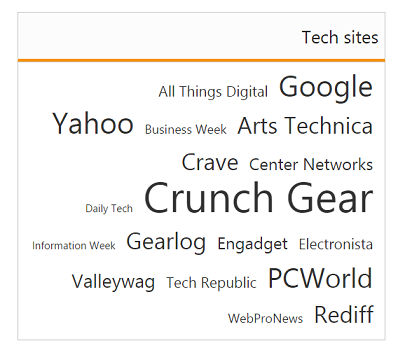

# RTL Support

The EnableRTL feature supports you to change the left-to-right alignment of the TagCloud widget to right-to-left (RTL). This displays the content from right-to-left in the widget. You can achieve this using EnableRTL property that is set false by default.

## Enabling RTL Support

The following steps explains you the EnableRTL property in TagCloud.



<%-- Configure datasource referring local data binding section and assign it to datasource property -- %>

<ej-tag-cloud id="tagcloud" datasource="ViewBag.datasource" title="Tech sites" enable-rtl="true">
    <e-tag-cloud-fields text="Text" url="Url" frequency="Frequency" />
</ej-tag-cloud>



The following screenshot illustrates the TagCloud control with RTL support.

