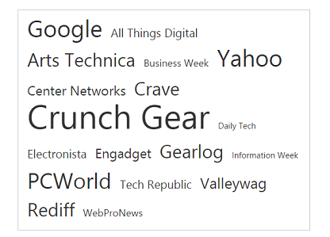
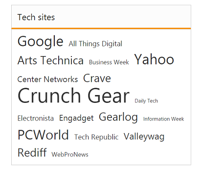
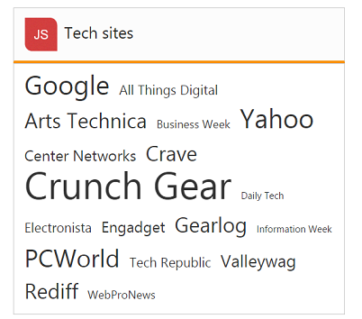

# Title Customization

## ShowTitle

The TagCloud items are displayed with a Title element by default. ShowTitle is a Boolean type, which allow us to Hide or Show the Title. This property is set true by default.

### How to disable title in TagCloud

The following step explains you on how to configure title for a TagCloud.



<%-- Configure datasource referring local data binding section and assign it to datasource property -- %>

<ej-tag-cloud id="tagcloud" datasource="ViewBag.datasource" show-title="false">
	<e-tag-cloud-fields text="Text" url="Url" frequency="Frequency" />
</ej-tag-cloud>



The following screenshot illustrates a TagCloud control when you set false to ShowTitle,

## Title

TagCloud widget allows us to set a custom Title text by using the Title property. By default Title property is set to string value “Title”.

### Defining title text for TagCloud

The following step explain to us on how to configure Title for a TagCloud.



<ej-tag-cloud id="tagcloud" datasource="ViewBag.datasource" title="Tech sites">
	<e-tag-cloud-fields text="Text" url="Url" frequency="Frequency" />
</ej-tag-cloud>



The following screenshot illustrates the TagCloud control with customized title text.

## TitleImage

TagCloud widget provides TitleImage to set an image for the title. You can set the desired image URL to TitleImage property.

### Defining Title Image for TagCloud

The following step explains us to configure TitleImage for a TagCloud.



<%-- Configure datasource referring local data binding section and assign it to datasource property -- %>

<ej-tag-cloud id="tagcloud" datasource="ViewBag.datasource" title="Tech sites" title-image="http://js.syncfusion.com/demos/web/images/waitingpopup/js_logo.png">
	<e-tag-cloud-fields text="Text" url="Url" frequency="Frequency" />
</ej-tag-cloud>



1. Using CSS class you can resize the Title image content as follows.



	



The following screenshot illustrates the TagCloud control with customized title image.

