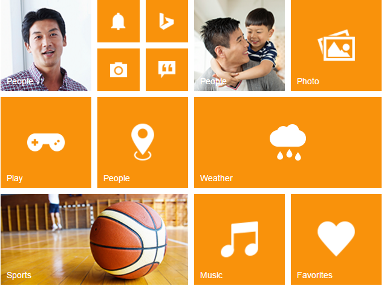

# Add Group Tiles

To make a Tile as grouped tile, you can use the following mentioned pre-defined classes.

<table>
<tr>
<th>
Class Name</th><th>
Explanation</th></tr>
<tr>
<td>
e-tile-group</td><td>
To group the column elements</td></tr>
<tr>
<td>
e-tile-column</td><td>
To align the tile in column manner</td></tr>
<tr>
<td>
e-tile-small-col-2</td><td>
To align the small size tiles</td></tr>
</table>
To render group tile, refer to the following code example.



    

           <!— Add tile control here -->

    



To render column grouped tile, you need to render the number of tiles inside a 
 element with class ‘column’. Then that column group element is appended to a 
 with class ‘group’.     

To render small-col-2 grouped tile, you need to render the number of tiles inside a 
 element with class ‘small-col-2’. Then that small-col-2 group element is appended to a 
 with class ‘column’. Then you need to append those column inside the main group 
 element.                                                     

 Refer the following code examples.



    

        <ej-tile id="tile1" image-position="@TileImagePosition.Fill" tile-size="@TileSize.Medium" image-url="../images/tile/windows/people_1.png" text="People"></ej-tile>
        

            <ej-tile id="tile2" image-position="@TileImagePosition.Center" tile-size="@TileSize.Small" image-url="../images/tile/windows/alerts.png"></ej-tile>
            <ej-tile id="tile3" image-position="@TileImagePosition.Center" tile-size="@TileSize.Small" image-url="../images/tile/windows/bing.png"></ej-tile>
            <ej-tile id="tile4" tile-size="@TileSize.Small" image-url="../images/tile/windows/camera.png"></ej-tile>
            <ej-tile id="tile5" image-position="@TileImagePosition.Center" tile-size="@TileSize.Small" image-url="../images/tile/windows/messages.png"></ej-tile>
        

        <ej-tile id="tile6" image-position="@TileImagePosition.Center" tile-size="@TileSize.Medium" image-url="../images/tile/windows/games.png" text="Play"></ej-tile>
        <ej-tile id="tile7" tile-size="@TileSize.Medium" image-url="../images/tile/windows/map.png" text="People"></ej-tile>
        <ej-tile id="tile8" image-position="@TileImagePosition.Fill" tile-size="@TileSize.Wide" image-url="../images/tile/windows/sports.png" text="Sports"></ej-tile>
    

    

        <ej-tile id="tile9" image-position="@TileImagePosition.Fill" tile-size="@TileSize.Medium" image-url="../images/tile/windows/people_2.png" text="People"></ej-tile>
        <ej-tile id="tile10" image-position="@TileImagePosition.Center" tile-size="@TileSize.Medium" image-url="../images/tile/windows/pictures.png" text="Photo"></ej-tile>
        <ej-tile id="tile11" image-position="@TileImagePosition.Center" tile-size="@TileSize.Wide" image-url="../images/tile/windows/weather.png" text="Weather"></ej-tile>
        <ej-tile id="tile12" image-position="@TileImagePosition.Center" tile-size="@TileSize.Medium" image-url="../images/tile/windows/music.png" text="Music"></ej-tile>
        <ej-tile id="tile13" image-position="@TileImagePosition.Center" tile-size="@TileSize.Medium" image-url="../images/tile/windows/favs.png" text="Favorites"></ej-tile>
    



