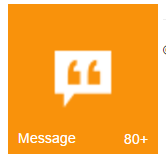

# Configure Badge

The Badge property handles badge specific functionalities like enable or disable the badge and setting badge value for Tile.

enabled property enables or disables the badge for a Tile. The Tile renders with hidden badge when it is set to false.

The value property is used to set the badge value to a Tile. By default, the Value is set to 1 on initialization. The text property is used to set the text instead of number for Tile badge. The max-value property is used to set the maximum badge value to a Tile. When you set the badge value greater than MaxValue, it shows maximum value in badge with plus symbol. The min-value property is used to set the minimum badge value to a Tile. When you set the badge value less than min-value, it shows minimum value in badge.

Refer to the following code examples.



<ej-tile id="tile" image-position="@TileImagePosition.Center" tile-size="@TileSize.Medium" image-url="../Images/tile/windows/messages.png" text="Message">
    <e-tile-badge enabled="true" max-value="80" min-value="10" value="88" />
</ej-tile>



