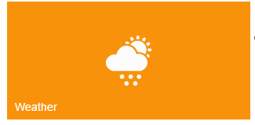

# Image Configuration

ImagePosition property is used to adjust the position of Tile image at the Center on initialization. The possible values for the ImagePosition are as follows

1. Center
2. TopCenter
3. BottomCenter
4. RightCenter
5. LeftCenter
6. TopLeft
7. TopRight 
8. BottomRight
9. BottomLeft 
10. Fill

ImageUrl property is used to set the background image for Tile, where the image is given in the path specified by ImageUrl property.

Refer to the following code examples.



<ej-tile id="tile" image-position="@TileImagePosition.Center" tile-size="@TileSize.Wide" image-url="../images/tile/windows/weather.png" text="Pictures"></ej-tile>



You can give images for each tile through CSS classes by using ImageClass property. You can define your desired styles in the specified class.

Refer to the following code examples.



<ej-tile id="tile" image-position="@TileImagePosition.Center" tile-size="@TileSize.Wide" image-class="Pictures" text="Pictures"></ej-tile>

  



