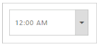
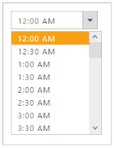

# Behavior Settings

## Set value of the TimePicker widget

You can use Value property to set default time for the TimePicker.

The following steps explains you on how to set the default value of the TimePicker.

1. Add the following code to the corresponding view page to render the TimePicker.



/*ej-Tag Helper code to render TimePicker*/

@*Add the following code example to the corresponding CSHTML page to render TimePicker widget with given time value*@
 <ej-time-picker id="time" value="DateTime.Now"></ej-time-picker>
 




/*Razor code to render TimePicker*/

    @{Html.EJ().TimePicker("time").Value(DateTime.Now).Render(); }



N> To render the TimePicker Control you can use either Razor or Tag helper code as given in the above code snippet.

Execute the above code to render the following output.

TimePicker default value
{:.caption}

## Enable/Disable TimePicker widget

TimePicker widget provides you an option to enable /disable the widget. You can disable the TimePicker by setting the “Enabled” property value as false.

The following steps explain you to enable/disable property in TimePicker widget.

1. Add the following code to the corresponding view page to render the TimePicker.



/*ej-Tag Helper code to render TimePicker*/

@*Add the following code example to the corresponding CSHTML page to render disabled TimePicker widget*@

 <ej-time-picker id="time" enabled="false"></ej-time-picker>
 





/*Razor code to render TimePicker*/

    @{Html.EJ().TimePicker("time").Enabled(false).Render(); }



Disabled TimePicker widget
{:.caption}

Execute the above code to render the following output.

## Restrict editing

TimePicker widget provides ReadOnly property to disable editing in the control. Therefore you can only read the value set to TimePicker and cannot modify it. The Value property allows you to set the default value for TimePicker widget when it is created.

### Configure TimePicker textbox to restrict editing

The following steps allows you to disable editing value in TimePicker.

1. Add the following code to the corresponding view page to render the TimePicker.



/*ej-Tag Helper code to render TimePicker*/

@*Add the following code example to the corresponding CSHTML page to render TimePicker widget*@

 <ej-time-picker id="time" read-only="true"></ej-time-picker>
 





/*Razor code to render TimePicker*/

    @{Html.EJ().TimePicker("time").ReadOnly(true).Render(); }



The following screenshot illustrates a TimePicker textbox configured to restrict editing.

' 

TimePicker with PopUp button and enable ReadOnly property
{:.caption}

## Rounded Corner

You can customize the shape of the TimePicker widget from regular rectangular shape to rounded rectangle shape using ShowRoundedCorner property that is set to false by default.

Configure Rounded corner to TimePicker Text box

The following steps explain you to change the edges of the textbox to rounded corner.

1. Add the following code to the corresponding view page to render the TimePicker.



/*ej-Tag Helper code to render TimePicker*/

@*Add the following code example to the corresponding CSHTML page to render TimePicker widget with rounded corner*@

<ej-time-picker id="time" show-rounded-corner="true"></ej-time-picker>
 





/*Razor code to render TimePicker*/

    @{Html.EJ().TimePicker("time").ShowRoundedCorner(true).Render(); }



The following screenshot illustrates a TimePicker when ShowRoundedCorner is set to “true”.

Rounded corner of TimePicker Textbox
{:.caption}

## Scaling

TimePicker widget provides you options to change its height, width and also to change popup height and width.

### Change TimePicker widget Height and Width

You can use Height and Width property to customize TimePicker width and height.

1. Add the following code to the corresponding view page to render the TimePicker.



/*ej-Tag Helper code to render TimePicker*/

@*Add the following code example to the corresponding CSHTML page to render TimePicker widget with specified height and width*@

<ej-time-picker id="time" height="50" width="150"></ej-time-picker>





/*Razor code to render TimePicker*/

    @{Html.EJ().TimePicker("time").Height("50").Width("150").Render(); }



Execute the above code to render the following output.

Changing Width and Height of the TimePicker.
{:.caption}

### Changing TimePicker PopupHeight and PopupWidth

You can use PopupHeight and PopupWidth property to customize TimePicker width and height.

1. Add the following code to the corresponding view page to render the TimePicker.



/*ej-Tag Helper code to render TimePicker*/

@*Add the following code example to the corresponding CSHTML page to render TimePicker widget with specified popup height and width*@

<ej-time-picker id="time" popup-height="170px" popup-width="150px"></ej-time-picker>
 




/*Razor code to render TimePicker*/

    @{Html.EJ().TimePicker("time").PopupHeight("170px").PopupWidth("150px").Render(); }



Execute the above code to render the following output.

Changing popup height and width
{:.caption}

## State persistence

TimePicker widget provide options to maintain the selected value after you refresh the page by using EnablePersistence property.

### Steps to use State persistence of the TimePicker

The following steps explains you to use EnablePersistence property.

1. Add the following code to the corresponding view page to render the TimePicker.



/*ej-Tag Helper code to render TimePicker*/

@*Add the following code example to the corresponding CSHTML page to render TimePicker widget*@

 <ej-time-picker id="time" enable-persistence="true"></ej-time-picker>
 




/*Razor code to render TimePicker*/

    @{Html.EJ().TimePicker("time").EnablePersistence(true).Render(); }



## Strict mode of the TimePicker

TimePicker widget provides you an option to set default value when there is no default value between MinTime and MaxTime by using EnableStrictMode property.  

### Steps to use EnableStrictMode property

The following steps explains you to use EnableStrictMode property.

1. Add the following code to the corresponding view page to render the TimePicker.



/*ej-Tag Helper code to render TimePicker*/

@*Add the following code example to the corresponding CSHTML page to render TimePicker widget with specifies min and max time*@

<ej-time-picker id="time" enable-strict-mode="true" min-time="10:00 AM" max-time="09:00 AM"></ej-time-picker>
  




/*Razor code to render TimePicker*/

    @{Html.EJ().TimePicker("time").MinTime("10:00 AM").MaxTime("09:00 PM").EnableStrictMode(true).Render(); }



Execute the above code to render the following output.

Using EnableStrictMode property
{:.caption}

## Interval

TimePicker widget provides you an option to change the interval of the hour, minute and seconds. 

### Steps to change the Time interval of the TimePicker control

The following steps explains you to change the Time Interval of the TimePicker.

1. Add the following code to the corresponding view page to render the TimePicker.



/*ej-Tag Helper code to render TimePicker*/

@*Add the following code example to the corresponding CSHTML page to render TimePicker widget*@

<ej-time-picker id="time" time-format="hh:mm:ss tt" hour-interval="2" minutes-interval="60" seconds-interval="20"></ej-time-picker>
 





/*Razor code to render TimePicker*/

    @{Html.EJ().TimePicker("time").TimeFormat("hh:mm:ss tt").HourInterval(2).MinutesInterval(60).SecondsInterval(20).Render();}



