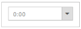

# Localization

You can globalize the TimePicker, so that users of different cultures can make use of it and post their content. For your convenience, you can format the TimePicker control to your culture. When your blog is in your culture, the viewers of your culture can understand about your company and its products. You can achieve localization using the “Locale” property. 

More than 350 culture specific files are available to localize the time. To know more about EJ globalize support, please refer the below link      
 [http://help.syncfusion.com/js/localization](http://help.syncfusion.com/js/localization) 

N> Seven culture-specific script files are available in the below specified location. For all other culture files, please download from the [GitHub](https://github.com/syncfusion/ej-global/tree/master/i18n) location.

<table>
<tr>
<td>

    (installed location)\Syncfusion\Essential Studio\{{ site.releaseversion }}\JavaScript\assets\scripts\i18n

    For example, If you have installed the Essential Studio package within C:\Program Files (x86), then navigate to the below location, 
    C:\Program Files (x86)\Syncfusion\Essential Studio\{{ site.releaseversion }}\JavaScript\assets\scripts\i18n

</td></tr>
</table>

The following code example is used to set TimePicker in Spanish language.

## Enabling Localization Support

The following steps explains you on how to enable Locale property for TimePicker.

1. Add the following code to the corresponding view page to render the TimePicker.



/*ej-Tag Helper code to render TimePicker*/

@*Add the following code example to the corresponding CSHTML page to render TimePicker widget with Spanish culture*@
 <ej-time-picker id="time" locale="es-ES"></ej-time-picker>





/*Razor code to render TimePicker*/

    @{Html.EJ().TimePicker("time").Locale("es-ES").Render();}   



N> To render the TimePicker Control you can use either Razor or Tag helper code as given in the above code snippet.

Execute the above code to render the following output.

TimePicker with es-ES Localization
{:.caption}

