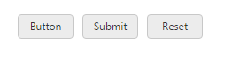

# Button types

Toggle Button is used as normal click able button, submitting form data, resetting the form data to its initial value. According to the usage of button, you can render the Toggle Button in the following three types by using the type property.

_Toggle Button Types_

<table>
<tr>
<th>
Button</th><th>
The button is a click able button </th></tr>
<tr>
<td>
Submit</td><td>
The button is a submit button (submits form-data)</td></tr>
<tr>
<td>
Reset    </td><td>
The button is a reset button (resets the form-data to its initial values)</td></tr>
</table>

The following steps explains you the details about rendering the Toggle Button with above mentioned types. 

1. In the View page, add the following button elements to configure Toggle Button widget.



/*ej-Tag Helper code to render ToggleButton*/

@*Add the code in CSHTML page to configure the widget and initialize the control*@

    

        <table>

            <tr>

                <td class="btnsht">

                    <ej-toggle-button id="toggleButton_button" size="@ButtonSize.Mini" show-rounded-corner="true" content-type="@ContentType.TextOnly" default-text="Button" active-text="Next" type="@ButtonType.Button" />
                </td>

                <td class="btnsht">

                    <ej-toggle-button id="toggleButton_submit" size="@ButtonSize.Mini" show-rounded-corner="true" content-type="@ContentType.TextOnly" default-text="Submit" active-text="Next" type="@ButtonType.Submit" />

                </td>

                <td class="btnsht">

                    <ej-toggle-button id="toggleButton_reset" size="@ButtonSize.Mini" show-rounded-corner="true" content-type="@ContentType.TextOnly" default-text="Reset" active-text="Next" type="@ButtonType.Reset" />

                </td>

            </tr>

        </table>

    





/*Razor code to render ToggleButton*/

    @*set toggle button type using type property*@

    <table>

        <tr>

            <td class="btnsht">

                @{Html.EJ().ToggleButton("toggleButton_button").Size(ButtonSize.Mini).ShowRoundedCorner(true).ContentType(ContentType.TextOnly).DefaultText("Button").ActiveText("Next").Type(ButtonType.Button).Render(); }

            </td>

             <td class="btnsht">

                @{Html.EJ().ToggleButton("toggleButton_submit").Size(ButtonSize.Mini).ShowRoundedCorner(true).ContentType(ContentType.TextOnly).DefaultText("Submit").ActiveText("Next").Type(ButtonType.Submit).Render(); }

            </td>
            <td class="btnsht">

                @{Html.EJ().ToggleButton("toggleButton_reset").Size(ButtonSize.Mini).ShowRoundedCorner(true).ContentType(ContentType.TextOnly).DefaultText("Reset").ActiveText("Next").Type(ButtonType.Reset).Render(); }

            </td>
        </tr>

    </table>



N> To render the ToggleButton Control you can use either Razor or Tag helper code as given in the above code snippet.

Execute the above code to render the following output.

Types of Toggle button
{:.caption}

