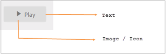
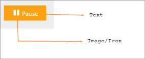

# Getting Started with ASP.NET Core ToggleButton

This section explains briefly about how to create a ToggleButton in your ASP.NET Core application.

## Create your first Toggle Button in ASP.NET Core

The Toggle Button control displays both text and images. The text displayed on the Toggle Button is contained in the Text property. The Toggle Button control display images using the SpriteCssClass and ImagePosition properties. The Toggle Buttons has theme support also.

The following screenshot illustrates a Toggle Button control. 

Toggle Button in OFF state_ 
{:.caption}

Toggle Button in ON state
{:.caption}

### Create a Toggle Button

Essential Studio ASP.NET Core Toggle Button control has a built-in feature to customize the size, text and images of button.

1. Create a .NetCore Project with the help of the given [ASP.NET Core-Getting Started](https://help.syncfusion.com/aspnet-core/gettingstarted/getting-started-1-1-0) documentation.
2. Add the following code example to the corresponding view page to render the Toggle Button. 

   ~~~ cshtml

/*ej-Tag Helper code to render ToggleButton*/

	<ej-toggle-button id="tbutton" size="Mini" show-rounded-corner="true" default-text="Play" />
    
   ~~~



/*Razor code to render ToggleButton*/

    @{Html.EJ().ToggleButton("tbutton").Size(ButtonSize.Mini).ShowRoundedCorner(true).DefaultText("Play").Render();}



N> To render the ToggleButton Control you can use either Razor or Tag helper code as given in the above code snippet.
  

3. Output of the above steps.

