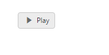
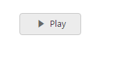

# Miscellaneous

## ShowRoundedCorner 

It sets the corner of Toggle Button in rounded shape. The Toggle Button, by default doesn’t have rounded corner. To set rounded corner, you can enable show-rounded-corner property.

The following steps explains you the details about rendering the Toggle Button with Rounded corner support. 

1. In the View page, add the following button elements to configure Toggle Button widget.



/*ej-Tag Helper code to render ToggleButton*/

@*Add the code in CSHTML page to configure the widget and initialize the control*@

	@*set rounded corner for toggle button*@       
	
	  <ej-toggle-button id="toggleButton_button" size="@ButtonSize.Mini" show-rounded-corner="true" content-type="@ContentType.TextAndImage" default-text="Play" active-text="Next" default-prefix-icon="e-icon e-mediaplay" active-prefix-icon="e-icon e-medianext" />





/*Razor code to render ToggleButton*/

    @*set rounded corner for toggle button*@
    
	@{Html.EJ().ToggleButton("toggleButton_button").Size(ButtonSize.Mini).ShowRoundedCorner(true).ContentType(ContentType.TextAndImage).DefaultText("Play").ActiveText("Next").DefaultPrefixIcon("e-icon e-mediaplay").ActivePrefixIcon("e-icon e-medianext").Render();}



N> To render the ToggleButton Control you can use either Razor or Tag helper code as given in the above code snippet.

Execute the above code to render the following output.

Toggle button with Rounder corner
{:.caption}

## PreventToggle

This property is used to prevent the state change of Toggle Button when it is clicked. When you set prevent-toggle property as true, then the state of the Toggle Button is not changed even though it is clicked. Default value of prevent-toggle is false.

The following steps explains you the details about rendering the Toggle Button with prevent-toggle property enabled.

1. In the View page, add the following button elements to configure Toggle Button widget.



/*ej-Tag Helper code to render ToggleButton*/

@*Add the code in CSHTML page to configure the widget and initialize the control*@

	@* set prevent toggle property for preventing states*@       

	<ej-toggle-button id="toggleButton_preventToggle" size="@ButtonSize.Small" show-rounded-corner="true" content-type="@ContentType.TextAndImage" default-text="Play" active-text="Next" default-prefix-icon="e-icon e-mediaplay" active-prefix-icon="e-icon e-medianext" prevent-toggle="true" />

	




/*Razor code to render ToggleButton*/

    @* set prevent toggle property for preventing states*@

    @{Html.EJ().ToggleButton("toggleButton_preventToggle").Size(ButtonSize.Small).ContentType(ContentType.TextAndImage).DefaultText("Play").ActiveText("Next").DefaultPrefixIcon("e-icon e-mediaplay").ActivePrefixIcon("e-icon e-medianext").PreventToggle(true).Render();
    
    }



Execute the above code to render the following output.

Toggle button with prevent Toggle
{:.caption}

