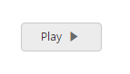

# RTL support

In some cases, it is necessary to use right to left alignment. You can render RTL support by using enable-rtl property. In RTL mode, when there is more than one content (image/text, image/image) in button, then the content is aligned in right to left format. For example, when text is in left and image is in right position, after applying right to left alignment these positions are interchanged.

The following steps explains you the details about rendering the Toggle Button with Right to left alignment support.

1. In the View page, add the following button elements to configure Toggle Button widget.



/*ej-Tag Helper code to render ToggleButton*/

//Add the code in CSHTML page to configure the widget and initialize the control

	@*enable right to left alignment*@

	     <ej-toggle-button id="toggleButton_preventToggle" size="@ButtonSize.Small" show-rounded-corner="true" content-type="@ContentType.TextAndImage" default-text="Play" active-text="Next" default-prefix-icon="e-icon e-mediaplay" active-prefix-icon="e-icon e-medianext" enable-rtl="true" />





/*Razor code to render ToggleButton*/

	@{Html.EJ().ToggleButton("toggleButton_preventToggle").Size(ButtonSize.Small).ShowRoundedCorner(true).ContentType(ContentType.TextAndImage).DefaultText("Play").ActiveText("Next").DefaultPrefixIcon("e-icon e-mediaplay").ActivePrefixIcon("e-icon e-medianext").EnableRTL(true).Render();}



N> To render the ToggleButton Control you can use either Razor or Tag helper code as given in the above code snippet.

In above mentioned code example PrefixIcon property is used and the icon that is to be on left side, (before text) is rendered on right side as EnableRTL property is used with PrefixIcon. Consequently, the alignment is changed in right to left order.

Output of above steps

Toggle button with RTL support
{:.caption}
