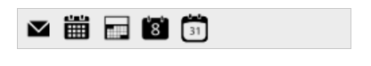
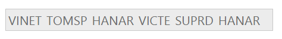

# Data Binding

Toolbar provides you a flexible approach for binding data from various data sources. There are various properties in Toolbar for Data Binding.

## Data fields and configuration 

The following sub-properties provides a way to bind either the local/remote data to the Toolbar control.

_Property Table of Toolbar control_

<table>
<tr>
<th>
Property</th><th>
Value type</th><th>
Description</th></tr>
<tr>
<td>
Datasource</td><td>
object</td><td>
It specifies the data source of the Toolbar. The data source contains the list of data for generating the Toolbar items.</td></tr>
<tr>
<td>
Fields</td><td>
object</td><td>
It specifies the mapping fields for the data items of the Toolbar.</td></tr>
<tr>
<td>
Id</td><td>
string</td><td>
It specifies the id of the element</td></tr>
<tr>
<td>
Text</td><td>
string</td><td>
It specifies the text content of the element.</td></tr>
<tr>
<td>
ImageUrl</td><td>
string</td><td>
This property defines the imageURL for the image location. While setting images, the folder name in which the images are stored should be set to imageUrl property.</td></tr>
<tr>
<td>
ImageAttributes</td><td>
string</td><td>
This property defines style for the image. While setting an image, styles can be applied such as height, width by using this property.</td></tr>
<tr>
<td>
SpriteCssClass</td><td>
string</td><td>
This property sets the Sprite CSS for the image element in Toolbar.</td></tr>
<tr>
<td>
HtmlAttributes</td><td>
object</td><td>
This property sets the HTML attribute for the Toolbar item. It can be any HTML attribute such as id, class, style.</td></tr>
<tr>
<td>
TooltipText</td><td>
string</td><td>
This property sets the text value for Toolbar item while mouse over in Toolbar.</td></tr>
<tr>
<td>
Query</td><td>
object</td><td>
It specifies the query to retrieve the data from online server.</td></tr>
<tr>
<td>
Group</td><td>
string</td><td>
It groups the given Toolbar items.</td></tr>
</table>

## Local data

To bind the Local Data to the Toolbar control, map the user-defined JSON data names with its appropriate data source field. You can bind data to Toolbar by mapping fields such as Id, SpriteCssClass, ImageUrl, group and TooltipText.

The following steps explain how you can bind local data to Toolbar Control.

In the View page, add Toolbar helper to configure Toolbar. 



// Add this code in your CSHTML page and refer local data section for data source

<ej-toolbar id="toolbar" dataSource="ViewBag.datasource">
    <e-toolbar-fields id="iconid" sprite-css-class="spriteCss">
</ej-toolbar>





public class ToolbarLocalBinding
{
	public string iconid { get; set; }
	public string spriteCss { get; set; }
}
public IActionResult Index()
{
	List<ToolbarLocalBinding> t = new List<ToolbarLocalBinding>();

	t.Add(new ToolbarLocalBinding { iconid = "1", spriteCss = "mailtools movetofolder" });
	t.Add(new ToolbarLocalBinding { iconid = "2", spriteCss = "mailtools categorize" });
	t.Add(new ToolbarLocalBinding { iconid = "3", spriteCss = "mailtools flag" });
	t.Add(new ToolbarLocalBinding { iconid = "4", spriteCss = "mailtools forward" });
	t.Add(new ToolbarLocalBinding { iconid = "5", spriteCss = "mailtools newmail" });
	ViewBag.datasource = t;
	return View();
}







ToolBar control bounded to Local Data
{:.caption}

## Remote data

You can bind Toolbar to Remote Data using DataManager and the query in fields is used to retrieve the data. DataManager supports the following types of data-binding: JSON, Web Services and OData. It uses two different classes; ej.DataManager for processing, and ej.Query for serving data. ej.DataManager communicates with data source and ej.Query generates data queries that are read by the DataManager. 

The following steps explain how you can bind remote data to Toolbar control.

1. In the View page, add Toolbar helper to configure Toolbar.



<ej-toolbar id="toolbarOdata" width="300px" query="ej.Query().from('Orders').take(6)">
    <e-toolbar-fields text="CustomerID" />
    <e-datamanager url="//mvc.syncfusion.com/Services/Northwnd.svc/"></e-datamanager>
</ej-toolbar>  



ToolBar control bounded to Remote Data
{:.caption}