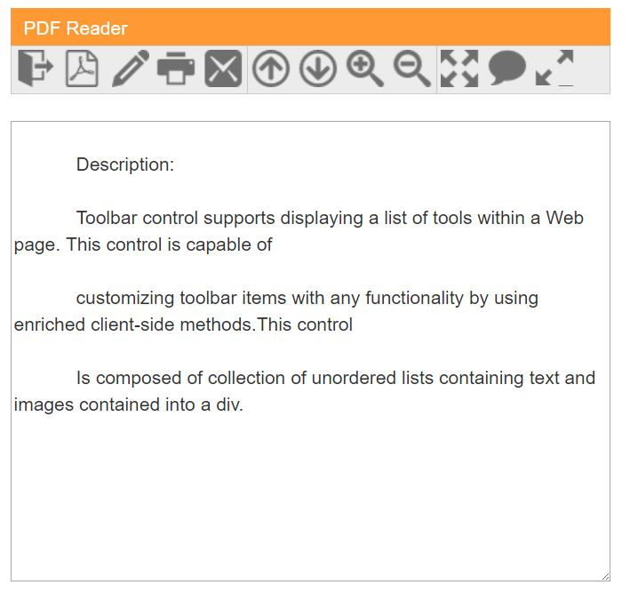
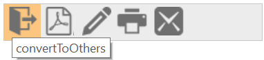
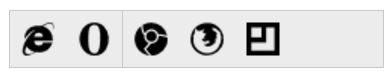

# Getting Started with ASP.NET Core Toolbar

This section explains how to create a Toolbar in your ASP.NET Core application. 

## Create your first Toolbar in ASP.NET Core

### Create Toolbar for PDF Reader

Toolbar control displays a list of tools in a web page. It is used to customize Toolbar items of any functionality by using enriched client-side methods. This control consists of a collection of unordered lists, containing text and images in 
.This section explains how to customize Toolbar control for a PDF Reader scenario.Here, the Toolbar consists of a title and text area like PDF Reader.

### Create a Toolbar

The basic rendering of ASP.NET Core Toolbar is achieved with default functionality.

1.Create an ASP.NET Core Project as given in [`ASP.NET Core`](https://help.syncfusion.com/aspnet-core/gettingstarted/getting-started-1-1-0) documentation

2.Then, add the mentioned code to the corresponding view page for Toolbar rendering.



   	 <!--ej-Tag Helper code to render Toolbar-->

        <ej-toolbar id="Toolbar1" >
            
        </ej-toolbar>


 


     <!--Razor code to render Toolbar-->
   
       @{Html.EJ().Toolbar("ToolbarItem").Render(); }



The following output is displayed.

Toolbar without Toolbar items
{:.caption}

N> To render the Toolbar Control, use either Razor or Tag helper code as given in the above code snippet.

### Initialize Toolbar Items

The toolbar consists of a list of items. To initialize the Toolbar items, use the following code: 



	/*ej-Tag Helper code to render Toolbar*/
	
	<ej-toolbar id="Toolbar2" width="250px">
        
         <e-toolbar-items>
            <e-toolbar-item sprite-css-class="PdfDocument e-icon convertToOthers" tooltip-text="Convert to others" />
            <e-toolbar-item sprite-css-class="PdfDocument e-icon convertToPdf" tooltip-text="convertToPdf" />
            <e-toolbar-item sprite-css-class="PdfDocument e-icon signature" tooltip-text="signature" />
            <e-toolbar-item sprite-css-class="PdfDocument e-icon print" tooltip-text="print" />
            <e-toolbar-item sprite-css-class="PdfDocument e-icon msg" tooltip-text="message" />
        </e-toolbar-items>
        
    </ej-toolbar> 





     <!--Razor code to render Toolbar-->
   
    @{Html.EJ().Toolbar("Toolbar1").Items(s =>
        {
            s.Add().SpriteCssClass("PdfDocument e-icon convertToOthers").TooltipText("Convert to others");
            s.Add().SpriteCssClass("PdfDocument e-icon convertToPdf ").TooltipText("convertToPdf");
            s.Add().SpriteCssClass("PdfDocument e-icon signature ").TooltipText("signature");
            s.Add().SpriteCssClass("PdfDocument e-icon print").TooltipText("print");
            s.Add().SpriteCssClass("PdfDocument e-icon msg").TooltipText("message");
        }).Width("250px").Render();
    }



 Apply the given styles in the code table to show the Toolbar items. You can refer images from any location.The images in the following code example were referred from:

[http://js.syncfusion.com/UG/Web/Content/](http://js.syncfusion.com/UG/Web/Content/)pdf-icon.png



    



Execute the code to render a Toolbar with a list of Toolbar items.

Toolbar with list of toolbar items
{:.caption}

### Render Toolbar Items with separator 

You can separate or group Toolbar items. The separation or grouping can be achieved by using the <b>enableSeparator</b> property.

Initialize the Toolbar items using the following code to group Toolbar items.



 	 <!--ej-Tag Helper code to render Toolbar-->

	  

          
       <ej-toolbar id="toolbarJson" enable-separator="true" orientation="@Orientation.Horizontal" width="250px" dataSource="ViewBag.datasource">
        <e-toolbar-fields id="id" sprite-css-class="spriteCss" group="group" />
       </ej-toolbar>
      
      





     <!--Razor code to render Toolbar-->
	 
       

	   
        @{Html.EJ().Toolbar("toolbarJson").EnableSeparator(true).Datasource((IEnumerable<Toolbar>)ViewBag.datasource1).ToolbarFields(f => f.ID("id").SpriteCssClass("spriteCss").Group("group")).Orientation(Orientation.Horizontal).Width("250px").Render(); }
      
	  





    public IActionResult Index()
        {
            List<ToolbarLocalBinding> t = new List<ToolbarLocalBinding>();

            t.Add(new ToolbarLocalBinding { id = "1", spriteCss = "IE", group = "g1" });
            t.Add(new ToolbarLocalBinding { id = "2", spriteCss = "chrome", group = "g2" });
            t.Add(new ToolbarLocalBinding { id = "3", spriteCss = "firefox", group = "g2" });
            t.Add(new ToolbarLocalBinding { id = "4", spriteCss = "bitty", group = "g2" });
            t.Add(new ToolbarLocalBinding { id = "5", spriteCss = "opera", group = "g1" });
            ViewBag.datasource = t;

            return View();
        }
		
		
		public class ToolbarLocalBinding
    {
        public string id { get; set; }
        public string spriteCss { get; set; }
        public string text { get; set; }
        public string group { get; set; }

    }


Add the following styles in the code table to display the Toolbar items as follows. 



 /*Additional style for Remaining toolbar items*/
 
       



Execute the code to render Toolbar items with a separator.

### Add Actions to Toolbar Items

After the Toolbar is rendered, you need to render the header and content area to create a PDF Reader.The below code sample shows how to render the header (toolbar), content section (PDF viewer area), and set the action to toolbar items.

N> PDF reading or rendering is not shown here. Simulation of the PDF Reader app to demonstrate the usage of Toolbar control is provided. PDF rendering area is ignored._

Initialize the content area and header as specified in the code table.



	 <!--ej-Tag Helper code to render Toolbar-->
    
	     
PDF Reader

       
            <ej-toolbar id="Toolbar4" width="450px">
                
                <e-toolbar-items>
				
                     <e-toolbar-item sprite-css-class="PdfDocument e-icon convertToOthers" tooltip-text="Convert to others"  />
                     <e-toolbar-item sprite-css-class="PdfDocument e-icon convertToPdf" tooltip-text="convertToPdf"/>
                     <e-toolbar-item sprite-css-class="PdfDocument e-icon signature" tooltip-text="signature"  />
                     <e-toolbar-item sprite-css-class="PdfDocument e-icon print" tooltip-text="print"/>
                     <e-toolbar-item sprite-css-class="PdfDocument e-icon msg" tooltip-text="message" />

                </e-toolbar-items>
                <e-toolbar-items>
				
				     <e-toolbar-item sprite-css-class="PdfDocument e-icon previous" tooltip-text="Previous" />
                     <e-toolbar-item sprite-css-class="PdfDocument e-icon next" tooltip-text="Next"  />
                     <e-toolbar-item sprite-css-class="PdfDocument e-icon zoomIn" tooltip-text="ZoomIn" />
                     <e-toolbar-item sprite-css-class="PdfDocument e-icon zoomOut" tooltip-text="ZoomOut" />

                </e-toolbar-items>
                <e-toolbar-items>

                     <e-toolbar-item sprite-css-class="PdfDocument e-icon fitOne" tooltip-text="Fit one" group="g3" />
                     <e-toolbar-item sprite-css-class="PdfDocument e-icon sticky" tooltip-text="Sticky" group="g3" />
                     <e-toolbar-item sprite-css-class="PdfDocument e-icon readMode" tooltip-text="Read Mode" group="g3" />

              </e-toolbar-items>

        </ej-toolbar>
         
        

            <textarea id="content" rows="16" cols="100" style="max-width:450px">

                Description:

                Toolbar control supports displaying a list of tools within a Web page. This control is capable of

                customizing toolbar items with any functionality by using enriched client-side methods.This control

                Is composed of collection of unordered lists containing text and images contained into a div.

            </textarea>

        





   <!--Razor code to render Toolbar-->
   
    
PDF Reader

   
      @{Html.EJ().Toolbar("Toolbar3").Items(s =>
        {
            s.Add().SpriteCssClass("PdfDocument e-icon convertToOthers").TooltipText("Convert to others");
            s.Add().SpriteCssClass("PdfDocument e-icon convertToPdf ").TooltipText("convertToPdf");
            s.Add().SpriteCssClass("PdfDocument e-icon signature ").TooltipText("signature");
            s.Add().SpriteCssClass("PdfDocument e-icon print").TooltipText("print");
            s.Add().SpriteCssClass("PdfDocument e-icon msg").TooltipText("message");
        }).Items(s1 =>
        {
            s1.Add().SpriteCssClass("PdfDocument e-icon previous").TooltipText("Previous");
            s1.Add().SpriteCssClass("PdfDocument e-icon next").TooltipText("Next");
            s1.Add().SpriteCssClass("PdfDocument e-icon zoomIn ").TooltipText("zoom In ");
            s1.Add().SpriteCssClass("PdfDocument e-icon zoomOut ").TooltipText("zoom Out ");

        }).Items(s2 =>
        {
            s2.Add().SpriteCssClass("PdfDocument e-icon fitOne").TooltipText("Fit one");
            s2.Add().SpriteCssClass("PdfDocument e-icon sticky").TooltipText("Sticky");
            s2.Add().SpriteCssClass("PdfDocument e-icon readMode").TooltipText("Read Mode");

        }).Width("450px").EnableSeparator(true).ClientSideEvents(e => e.Click("click")).Render();
    }

     
    

        <textarea id="content" rows="17" cols="100" style="max-width:450px">

            Description:

            Toolbar control supports displaying a list of tools within a Web page. This control is capable of

            customizing toolbar items with any functionality by using enriched client-side methods.This control

            Is composed of collection of unordered lists containing text and images contained into a div.

        </textarea>

    



You can apply the following styles with the previous styles to design the PDF header and content area. 



      



PDF Reader Appearance
{:.caption}

So far, you have added the required toolbar items and configured its appearance. When you click Toolbar items, the operation is performed through client-slide click event. 

The following code example explains how to perform operations when you click the Toolbar items.



		 <!--ej-Tag Helper code to render Toolbar-->

        
PDF Reader

		
            <ej-toolbar id="Toolbar4" width="450px"  click="click">
                
                <e-toolbar-items>
				
                     <e-toolbar-item sprite-css-class="PdfDocument e-icon convertToOthers" tooltip-text="Convert to others"  />
                     <e-toolbar-item sprite-css-class="PdfDocument e-icon convertToPdf" tooltip-text="convertToPdf"/>
                     <e-toolbar-item sprite-css-class="PdfDocument e-icon signature" tooltip-text="signature"  />
                     <e-toolbar-item sprite-css-class="PdfDocument e-icon print" tooltip-text="print"/>
                     <e-toolbar-item sprite-css-class="PdfDocument e-icon msg" tooltip-text="message" />

                </e-toolbar-items>
                <e-toolbar-items>
				
				     <e-toolbar-item sprite-css-class="PdfDocument e-icon previous" tooltip-text="Previous" />
                     <e-toolbar-item sprite-css-class="PdfDocument e-icon next" tooltip-text="Next"  />
                     <e-toolbar-item sprite-css-class="PdfDocument e-icon zoomIn" tooltip-text="ZoomIn" />
                     <e-toolbar-item sprite-css-class="PdfDocument e-icon zoomOut" tooltip-text="ZoomOut" />

                </e-toolbar-items>
                <e-toolbar-items>

                     <e-toolbar-item sprite-css-class="PdfDocument e-icon fitOne" tooltip-text="Fit one" group="g3" />
                     <e-toolbar-item sprite-css-class="PdfDocument e-icon sticky" tooltip-text="Sticky" group="g3" />
                     <e-toolbar-item sprite-css-class="PdfDocument e-icon readMode" tooltip-text="Read Mode" group="g3" />

              </e-toolbar-items>

        </ej-toolbar>
            





      <!--Razor code to render Toolbar-->
   
    @{Html.EJ().Toolbar("Toolbar3").Items(s =>
        {
            s.Add().SpriteCssClass("PdfDocument e-icon convertToOthers").TooltipText("Convert to others");
            s.Add().SpriteCssClass("PdfDocument e-icon convertToPdf ").TooltipText("convertToPdf");
            s.Add().SpriteCssClass("PdfDocument e-icon signature ").TooltipText("signature");
            s.Add().SpriteCssClass("PdfDocument e-icon print").TooltipText("print");
            s.Add().SpriteCssClass("PdfDocument e-icon msg").TooltipText("message");
        }).Items(s1 =>
        {
            s1.Add().SpriteCssClass("PdfDocument e-icon previous").TooltipText("Previous");
            s1.Add().SpriteCssClass("PdfDocument e-icon next").TooltipText("Next");
            s1.Add().SpriteCssClass("PdfDocument e-icon zoomIn ").TooltipText("zoom In ");
            s1.Add().SpriteCssClass("PdfDocument e-icon zoomOut ").TooltipText("zoom Out ");

        }).Items(s2 =>
        {
            s2.Add().SpriteCssClass("PdfDocument e-icon fitOne").TooltipText("Fit one");
            s2.Add().SpriteCssClass("PdfDocument e-icon sticky").TooltipText("Sticky");
            s2.Add().SpriteCssClass("PdfDocument e-icon readMode").TooltipText("Read Mode");

        }).Width("450px").EnableSeparator(true).ClientSideEvents(e => e.Click("click")).Render();
    }

    
   


