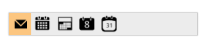

# Keyboard Navigation

The entire Toolbar commands can be accessed through the keyboard by specifying the Keyboard Shortcut listed in the following table.

_List of keyboard shortcuts_

<table>
<tr>
<th>
Keyboard Shortcut</th><th>
Function</th></tr>
<tr>
<td>
Alt + j</td><td>
Focuses the control</td></tr>
<tr>
<td>
UP</td><td>
Navigates up and left.</td></tr>
<tr>
<td>
Down</td><td>
Navigates down and right.</td></tr>
<tr>
<td>
Left</td><td>
Navigates up and left.</td></tr>
<tr>
<td>
Right</td><td>
Navigates down and right.</td></tr>
<tr>
<td>
Home</td><td>
Navigates to the starting item.</td></tr>
<tr>
<td>
End</td><td>
Navigates to the ending item.</td></tr>
<tr>
<td>
Enter</td><td>
Selects the focused item</td></tr>
</table>

The following code example illustrates shortcuts associated with the Toolbar items.



// Add this code in your CSHTML page and refer local data section for data source

<ej-toolbar id="toolbar" width="250px" dataSource="ViewBag.datasource">
    <e-toolbar-fields id="iconid" sprite-css-class="spriteCss">
</ej-toolbar>



ToolBar control with Keyboard shortcuts
{:.caption}