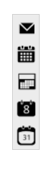

# Orientation

The Toolbar control supports both vertical and horizontal orientations, allowing it to fit into any scenario. The Orientation property of Toolbar defines the orientation in which the control is rendered. Set the value to this property as enum or string type. It accepts the following values.

* Syncfusion.JavaScript.Orientation.Horizontal
* Syncfusion.JavaScript.Orientation.Vertical

The following section explains you on how to set orientation for the toolbar.

## Horizontal

By default the Orientation property sets the Toolbar in horizontal orientation. You can refer the following code to set horizontal orientation for Toolbar control. Default value of Orientation is Horizontal.



// Add this code in your CSHTML page and refer local data section for data source

<ej-toolbar id="toolbar" width="250px" orientation="@Orientation.Horizontal" dataSource="ViewBag.datasource">
	<e-toolbar-fields id="iconid" sprite-css-class="spriteCss">
</ej-toolbar>



The following screenshot illustrates a Toolbar with horizontal orientation.

Toolbar with Horizontal Orientation
{:.caption}

## Vertical

This property sets the Toolbar in vertical orientation. You can refer the following code to set Vertical Orientation for Toolbar control.



// Add this code in your CSHTML page and refer local data section for data source

<ej-toolbar id="toolbar" width="30px" orientation="@Orientation.Vertical" dataSource="ViewBag.datasource">
	<e-toolbar-fields id="iconid" sprite-css-class="spriteCss">
</ej-toolbar>


   
The following screenshot illustrates a Toolbar with vertical orientation.

Toolbar with Vertical Orientation
{:.caption}