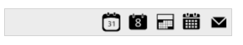

# RTL

EnableRTL property is Boolean type, which allow us to change the left-to-right alignment of the Toolbar to right-to-left (RTL) that sets the Toolbar to do its actions from right to left. Default value of EnableRTL is false. You can specify the EnableRTL property in the script as below, 



// Add this code in your CSHTML page and refer local data section for data source

<ej-toolbar id="toolbarJson" enable-rtl="true" width="250px" dataSource="ViewBag.datasource">
	<e-toolbar-fields id="iconid" sprite-css-class="spriteCss">
</ej-toolbar>



Toolbar from RTL
{:.caption}