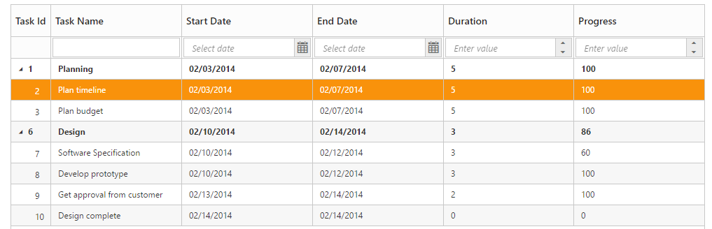
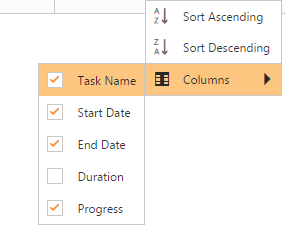
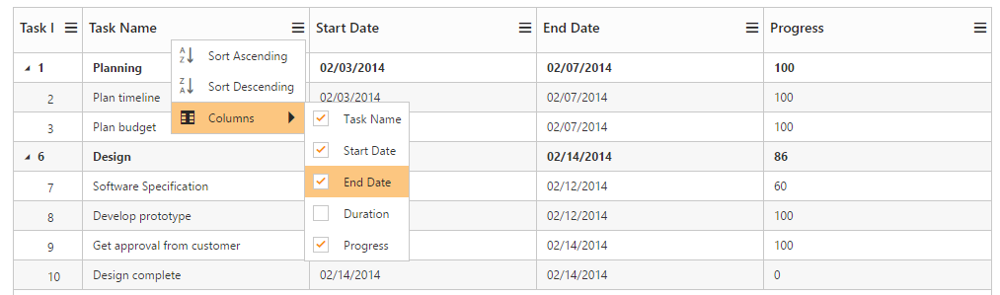

# Columns

The TreeGrid column displays the information from a bounded data source and it is editable to update the task details through TreeGrid.

## Column Resizing

You can change the width of the column in TreeGrid to show the entire text of the column by resizing the column. The following code example shows you how to enable the Column Resize feature at Gantt initialize.



<ej-tree-grid id="TreeGridContainer" allow-column-resize="true"></ej-tree-grid>



## Column Template

Column Template is used to customize the column’s look and feel based on requirement.

The following code example shows you how to display the icon in the TreeGrid column.


 


public partial class TreeGridController : Controller

{

	// GET: /TreeGridColumnTemplate/

	public ActionResult TreeGridColumnTemplate()

	{

		var data=this.GetColumnTemplateDataSource();

		ViewBag.datasource = data;

		return View();

	}

	private List<ColumnTemplate> GetColumnTemplateDataSource()

	{

		List<ColumnTemplate> TreeGridCollection = new List<ColumnTemplate>();

		ColumnTemplate ParentRecord = null;

		ParentRecord = new ColumnTemplate()

		{

			Name = "JS",

			DateModified = "06/26/2014",

			Type = "File Folder",

			DateCreated = "06/16/2014",

			Children = new List<ColumnTemplate>()

		};

		ColumnTemplate ParentRecord1 = new ColumnTemplate()

		{

			Name = "sample",

			DateModified = "06/26/2014",

			Type = "File Folder",

			DateCreated = "06/16/2014",

			Children = new List<ColumnTemplate>()

		};

		ColumnTemplate ParentRecord2 = new ColumnTemplate()

		{

			Name = "web",

			DateModified = "06/26/2014",

			Type = "File Folder",

			DateCreated = "06/16/2014",

			Children = new List<ColumnTemplate>()

		};

		ColumnTemplate ParentRecord3 = new ColumnTemplate()

		{

			Name = "treegrid",

			DateModified = "06/26/2014",

			Type = "File Folder",

			DateCreated = "06/16/2014",

			Children = new List<ColumnTemplate>()

		};

		ColumnTemplate ChildRecord1 = new ColumnTemplate()

		{

			Name = "treegrid.html",

			DateModified = "06/26/2014",

			Type = "HTML document",

			DateCreated = "06/16/2014",

		};

		ColumnTemplate ChildRecord2 = new ColumnTemplate()

		{

			Name = "editing.html",

			DateModified = "06/26/2014",

			Type = "HTML document",

			DateCreated = "06/16/2014",

		};

		ColumnTemplate ChildRecord3 = new ColumnTemplate()

		{

			Name = "sorting.html",

			DateModified = "06/26/2014",

			Type = "HTML document",

			DateCreated = "06/16/2014",

		};

		ParentRecord3.Children.Add(ChildRecord1);

		ParentRecord3.Children.Add(ChildRecord2);

		ParentRecord3.Children.Add(ChildRecord3);

		ParentRecord2.Children.Add(ParentRecord3);

		ParentRecord1.Children.Add(ParentRecord2);

		ParentRecord.Children.Add(ParentRecord1);

		TreeGridCollection.Add(ParentRecord);

		return TreeGridCollection;

	}

	public class ColumnTemplate

	{

		public string Name

		{

			get;

			set;

		}

		public string DateModified

		{

			get;

			set;

		}

		public string Type

		{

			get;

			set;

		}

		public string DateCreated

		{

			get;

			set;

		}

		public List<ColumnTemplate> Children

		{

			get;

			set;

		}

	}
}



   

 

    <ej-tree-grid id="TreeGridContainer" datasource="ViewBag.datasource" child-mapping="Children">
        <e-tree-grid-columns>
            <e-tree-grid-column field="Name" header-text="Name" is-template-column="true" template-id="customColumnTemplate" />
            <e-tree-grid-column field="Type" header-text="Type" />
            <e-tree-grid-column field="DateCreated" header-text="Date Created" />
            <e-tree-grid-column field="DateModified" header-text="Date Modified" />
        </e-tree-grid-columns>
    </ej-tree-grid> 


  
The following screenshot displays the customized column in TreeGrid control.

## Column Filtering

Column Filtering in TreeGrid is used to filter the records by single or multiple column conditions. In TreeGrid control, column filtering can be enabled with  allow-filtering property, by setting this property to ‘true’, a filter bar is rendered in all available columns, providing filtering support to every columns. You can also limit filtering to specific column by setting ‘false’ to allow-filtering property in each column object.

Filtering modes can be toggled between Immediate and OnEnter modes using FilterBarMode property.

* Immediate- In this mode, filtering starts with key press event.
* OnEnter- In this mode, filtering starts when enter key is pressed.

Filtering type can be defined by FilterEditType property in each column object.

### FilterEditType:

* String
* Numeric
* Boolean
* Dropdownlist
* Datepicker
* Datetimepicker



<ej-tree-grid id="TreeGridContainer" datasource="ViewBag.datasource" allow-filtering="true" child-mapping="children">
    <e-tree-grid-columns>
        <e-tree-grid-column field="TaskId" header-text="Task Id" width=45 edit-type="Numeric" allow-filtering="false"/>
        <e-tree-grid-column field="TaskName" header-text="Task Name" edit-type="String" filter-edit-type="String"/>
        <e-tree-grid-column field="StartDate" header-text="Start Date" edit-type="Datepicker" filter-edit-type="Datepicker" />
        <e-tree-grid-column field="EndDate" header-text="End Date" edit-type="Datepicker" filter-edit-type="Datepicker" />
        <e-tree-grid-column field="Duration" header-text="Duration" edit-type="Numeric" filter-edit-type="Numeric" />
        <e-tree-grid-column field="Progress" header-text="Progress" edit-type="Numeric" filter-edit-type="Numeric" />
    </e-tree-grid-columns>
</ej-tree-grid> 



The following screenshot displays the column filtering in TreeGrid control.

## Column Chooser

TreeGrid supports enabling and disabling the visibility of the columns dynamically with the show-column-chooser property. By using this property, the visibility of the custom columns can also be toggled. The Column chooser option is rendered as sub menu item within column menu in the TreeGrid columns.

The column menu is enabled with the show-column-chooser  property and the default value for this property is false

The column menu provides the following options

* Sort Ascending
* Sort Descending
* Columns 

The Sort Ascending and Sort Descending options are enabled or disabled by using the allow-sorting property. With these options, single level sorting can be performed in the TreeGrid columns. To perform multilevel sorting, the allow-multi-sorting property should be enabled. 

You can also disable the visibility of the particular column in column collection manually by setting the Visible property to false.



<ej-tree-grid id="TreeGridContainer" datasource="ViewBag.datasource" allow-sorting="true" show-column-chooser="true" child-mapping="Children" allow-multi-sorting="true">
    <e-tree-grid-columns>
        <e-tree-grid-column field="TaskId" header-text="Task Id" width=45 edit-type="Numeric"/>
        <e-tree-grid-column field="TaskName" header-text="Task Name" edit-type="String" />
        <e-tree-grid-column field="StartDate" header-text="Start Date" edit-type="Datepicker" />
        <e-tree-grid-column field="EndDate" header-text="End Date" edit-type="Datepicker" />
        <e-tree-grid-column field="Duration" header-text="Duration" edit-type="Numeric" visible="false"/>
        <e-tree-grid-column field="Progress" header-text="Progress" edit-type="Numeric" />
    </e-tree-grid-columns>
</ej-tree-grid>    
     


## Command Column

### Default action buttons

Using command columns in TreeGrid, we can display a separate column to perform CRUD operations.It is also possible to perform any custom actions by using custom command buttons. Command column can be defined in TreeGrid using `Commands` property.
A command column can be customized by using `Type` and `ButtonOptions` properties.

* **Type** – Using this property we can add required action buttons in TreeGrid command column such as edit,delete,save and cancel.
* **ButtonOptions** - Using this property we can customize the button in the command column with the properties available in [Button](https://help.syncfusion.com/api/js/ejbutton#members "Button").


<ej-tree-grid id="TreeGridControlCommand">
            <e-tree-grid-columns>
                <e-tree-grid-column header-text="Manage Records">
                    <e-tree-grid-command>
                        <e-tree-grid-commands type="edit">
                            <button-options text="Edit" width="58" />
                        </e-tree-grid-commands>
                        <e-tree-grid-commands type="delete">
                            <button-options text="Delete" width="58" />
                        </e-tree-grid-commands>
                        <e-tree-grid-commands type="save">
                            <button-options text="save" width="58" />
                        </e-tree-grid-commands>
                        <e-tree-grid-commands type="cancel">
                            <button-options text="cancel" width="58" />
                        </e-tree-grid-commands>
                    </e-tree-grid-command>
                </e-tree-grid-column>
            </e-tree-grid-columns>
    </ej-tree-grid>


 

### Custom buttons

We can also add custom buttons to the command column by specifying text value other than default buttons to the type property. We can also bind actions to the custom button using [Click](https://help.syncfusion.com/api/js/ejbutton#events:click "click") client side event of Button.


<ej-tree-grid id="TreeGridControlCommand">
            <e-tree-grid-columns>
               <e-tree-grid-column header-text="Manage Records">
                    <e-tree-grid-command>
                        <e-tree-grid-commands type="details">
                            <button-options text="Details" width="58" click="onClick" />
                        </e-tree-grid-commands>                        
                    </e-tree-grid-command>
                </e-tree-grid-column>
            </e-tree-grid-columns>
</ej:TreeGrid>



 
