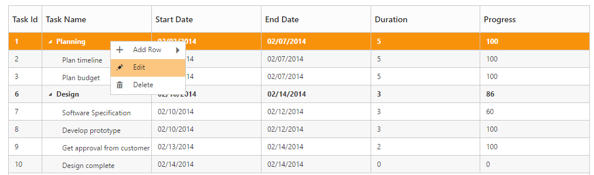
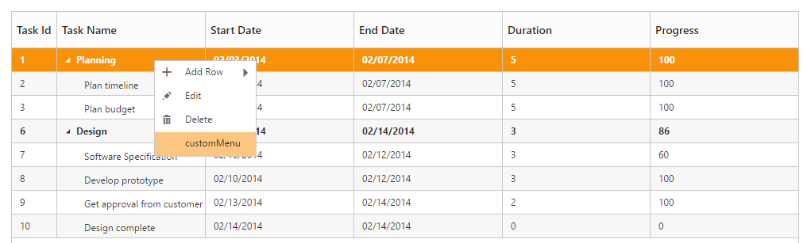

# Context Menu

Context menu in TreeGrid control is used to manipulate (add, edit and delete) the tree grid rows. In TreeGrid, context menu can be enabled with context-menu-settings API. The context-menu-settings property contains two inner properties show-context-menu and context-menu-items.

The show-context-menu  property is used to enable or disable the context menu, default value for this property is false.

The  context-menu-items property is used to add the menu items to context menu, this property renders ‘Add’ and ‘Delete’ by default when the menu items are not provided.



public partial class TreeGridController : Controller
    {
        //
        // GET: /Default/

        public ActionResult Default()
        {
            var data = this.GetDefaultData();
            ViewBag.datasource = data;
            ViewBag.contextMenuItems = new List<String>() { "Add", "Edit", "Delete" };
            return View();
        }

        private List<BusinessObject> GetDefaultData()
        {
            List<BusinessObject> BusinessObjectCollection = new List<BusinessObject>();

            BusinessObject Record1 = null;

            Record1 = new BusinessObject()
            {
                TaskId = 1,
                TaskName = "Planning",
                StartDate = "02/03/2014",
                EndDate = "02/07/2014",
                Progress = 100,
                Duration = 5,
                Children = new List<BusinessObject>(),
            };

            BusinessObject Child1 = new BusinessObject()
            {
                TaskId = 2,
                TaskName = "Plan timeline",
                StartDate = "02/03/2014",
                EndDate = "02/07/2014",
                Duration = 5,
                Progress = 100
            };

            BusinessObject Child2 = new BusinessObject()
            {
                TaskId = 3,
                TaskName = "Plan budget",
                StartDate = "02/03/2014",
                EndDate = "02/07/2014",
                Duration = 5,
                Progress = 100
            };

            BusinessObject Child3 = new BusinessObject()
            {
                TaskId = 4,
                TaskName = "Allocate resources",
                StartDate = "02/03/2014",
                EndDate = "02/07/2014",
                Duration = 5,
                Progress = 100
            };

            BusinessObject Child4 = new BusinessObject()
            {
                TaskId = 5,
                TaskName = "Planning complete",
                StartDate = "02/07/2014",
                EndDate = "02/07/2014",
                Duration = 0,
                Progress = 0
            };

            Record1.Children.Add(Child1);
            Record1.Children.Add(Child2);
            BusinessObject Record2 = new BusinessObject()
            {
                TaskId = 6,
                TaskName = "Design",
                StartDate = "02/10/2014",
                EndDate = "02/14/2014",
                Progress = 86,
                Duration = 3,
                Children = new List<BusinessObject>(),
            };

            BusinessObject Child5 = new BusinessObject()
            {
                TaskId = 7,
                TaskName = "Software Specification",
                StartDate = "02/10/2014",
                EndDate = "02/12/2014",
                Duration = 3,
                Progress = 60
            };

            BusinessObject Child6 = new BusinessObject()
            {
                TaskId = 8,
                TaskName = "Develop prototype",
                StartDate = "02/10/2014",
                EndDate = "02/12/2014",
                Duration = 3,
                Progress = 100
            };

            BusinessObject Child7 = new BusinessObject()
            {
                TaskId = 9,
                TaskName = "Get approval from customer",
                StartDate = "02/13/2014",
                EndDate = "02/14/2014",
                Duration = 2,
                Progress = 100
            };

            BusinessObject Child8 = new BusinessObject()
            {
                TaskId = 10,
                TaskName = "Design complete",
                StartDate = "02/14/2014",
                EndDate = "02/14/2014",
                Duration = 0,
                Progress = 0
            };

            Record2.Children.Add(Child5);
            Record2.Children.Add(Child6);
            Record2.Children.Add(Child7);
            Record2.Children.Add(Child8);
            BusinessObjectCollection.Add(Record1);
            BusinessObjectCollection.Add(Record2);
            return BusinessObjectCollection;
        }

        public class BusinessObject
        {
            public int TaskId
            {
                get;
                set;
            }

            public string TaskName
            {
                get;
                set;
            }

            public string StartDate
            {
                get;
                set;
            }

            public string EndDate
            {
                get;
                set;
            }

            public int Duration
            {
                get;
                set;
            }

            public int Progress
            {
                get;
                set;
            }
            public string Priority
            {
                get;
                set;
            }
            public bool InProgress
            {
                get;
                set;
            }
            public DateTime FilterStartDate
            {
                get;
                set;
            }
            public DateTime FilterEndDate
            {
                get;
                set;
            }
            public List<BusinessObject> Children
            {
                get;
                set;
            }

        }
    }





<ej-tree-grid id="TreeGridContainer" datasource="ViewBag.datasource" child-mapping="Children" tree-column-index="1">
    <e-tree-grid-edit-settings allow-editing="true" edit-mode="@TreeGridEditMode.RowEditing"></e-tree-grid-edit-settings>
    <e-tree-grid-context-menu-settings show-context-menu="true" context-menu-items="ViewBag.contextMenuItems"></e-tree-grid-context-menu-settings>
    <e-tree-grid-columns>
        <e-tree-grid-column field="TaskId" header-text="Task Id" width=45 edit-type="Numeric" />
        <e-tree-grid-column field="TaskName" header-text="Task Name" edit-type="String" />
        <e-tree-grid-column field="StartDate" header-text="Start Date" edit-type="Datepicker" />
        <e-tree-grid-column field="EndDate" header-text="End Date" edit-type="Datepicker" />
        <e-tree-grid-column field="Duration" header-text="Duration" edit-type="Numeric" />
        <e-tree-grid-column field="Progress" header-text="Progress" edit-type="Numeric" />
    </e-tree-grid-columns>
</ej-tree-grid>  


 

The following screenshot displays the Context menu in TreeGrid control.

## ContextMenu Customization

Context menu can be customized by adding a new custom menu item to it. In TreeGrid, context menu can be customized using context-menu-open client side event. This event is triggered when the context menu is rendered with mouse right click action. The following properties are available in the event,

* headerText: Display text for menu item.
* iconPath: Image location for menu item.
* eventHandler: Client side event for menu item click.



<ej-tree-grid id="TreeGridContainer" datasource="ViewBag.datasource" child-mapping="Children" tree-column-index="1" context-menu-open="ContextMenuOpen">
    <e-tree-grid-edit-settings allow-editing="true" edit-mode="@TreeGridEditMode.RowEditing"></e-tree-grid-edit-settings>
    <e-tree-grid-context-menu-settings show-context-menu="true" context-menu-items="ViewBag.contextMenuItems"></e-tree-grid-context-menu-settings>
    <e-tree-grid-columns>
        <e-tree-grid-column field="TaskId" header-text="Task Id" width=45 edit-type="Numeric" />
        <e-tree-grid-column field="TaskName" header-text="Task Name" edit-type="String" />
        <e-tree-grid-column field="StartDate" header-text="Start Date" edit-type="Datepicker" />
        <e-tree-grid-column field="EndDate" header-text="End Date" edit-type="Datepicker" />
        <e-tree-grid-column field="Duration" header-text="Duration" edit-type="Numeric" />
        <e-tree-grid-column field="Progress" header-text="Progress" edit-type="Numeric" />
    </e-tree-grid-columns>
</ej-tree-grid>  



The following screenshot displays the customization of Context menu in TreeGrid control.

