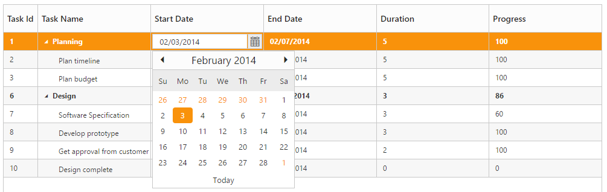

# Editing

The TreeGrid control provides built-in support for Editing cell items. 

## Cell Editing

Update the task details through grid Cell Editing by setting EditMode as CellEditing.

The following code example shows you how to enable CellEditing in TreeGrid control.



<ej-tree-grid id="TreeGridContainer" datasource="ViewBag.datasource" child-mapping="Children" tree-column-index="1">
    <e-tree-grid-edit-settings allow-editing="true" edit-mode="@TreeGridEditMode.CellEditing"></e-tree-grid-edit-settings>
    <e-tree-grid-columns>
        <e-tree-grid-column field="TaskId" header-text="Task Id" width=45 edit-type="Numeric" />
        <e-tree-grid-column field="TaskName" header-text="Task Name" edit-type="String" />
        <e-tree-grid-column field="StartDate" header-text="Start Date" edit-type="Datepicker" />
        <e-tree-grid-column field="EndDate" header-text="End Date" edit-type="Datepicker" />
        <e-tree-grid-column field="Duration" header-text="Duration" edit-type="Numeric" />
        <e-tree-grid-column field="Progress" header-text="Progress" edit-type="Numeric" />
    </e-tree-grid-columns>
</ej-tree-grid>  



The output of TreeGrid with CellEditing is as follows.

### Row Editing

It is possible to make the entire row to editable state and to update a record by setting `EditSettings.EditMode` as `RowEditing`.

The following code example shows you how to enable RowEditing in TreeGrid control.



<ej-tree-grid id="TreeGridControlEditing">

    //...

    <e-tree-grid-edit-settings allow-editing="true" edit-mode="@TreeGridEditMode.RowEditing"></e-tree-grid-edit-settings>

</ej-tree-grid>



The following output is displayed as a result of the above code example.

### Batch Editing

The batch editing support in the tree grid is used to save all added, edited, and deleted changes to the database with a single action. This can be enabled by setting the `EditMode` property to `BatchEditing`. The following code example shows how to enable the batchEditing in the tree grid control.



<ej-tree-grid id="TreeGridControlEditing">

    //...

    <e-tree-grid-edit-settings allow-editing="true" edit-mode="@TreeGridEditMode.BatchEditing" begin-edit-action="Click"></e-tree-grid-edit-settings>

</ej-tree-grid>



The output of s tree grid with `BatchEditing` is as follows.

In batch editing, the edit mode can be changed to **Cell** or **Row** or **Dialog** with the `BatchEditSettings.EditMode` property. The following code snippet shows how to set the editMode to row in the `BatchEditSettings` property.



<ej-tree-grid id="TreeGridControlEditing">

    //...

    <e-tree-grid-edit-settings allow-editing="true" edit-mode="@TreeGridEditMode.BatchEditing" begin-edit-action="Click">
	    <e-tree-grid-batch-edit-settings edit-mode="Row"/>
    </e-tree-grid-edit-settings>    

</ej-tree-grid>



The output of a tree grid with `BatchEditSettings` and `EditMode` set as `Row` is as follows.

N> After modifying all changes in the tree grid, click the save button in the toolbar. The `ActionComplete` event will be triggered with updated records in the `batchChanges` argument with `requestType` argument as `batchSave`. Using this event, you can update all the modified records to the database.

### Dialog Editing

Set `EditSettings.EditMode` as `DialogEditing` to edit/add a record using dialog.

The following code example shows you how to enable dialog editing in TreeGrid control.



<ej-tree-grid id="TreeGridControlEditing">
    //...
    <e-tree-grid-edit-settings allow-editing="true" edit-mode="@TreeGridEditMode.DialogEditing"></e-tree-grid-edit-settings>
</ej-tree-grid>



The output of the TreeGrid with dialog editing is as follows.

#### Dialog Template

You can edit any of the fields pertaining to a single record of data and apply it to a template so that the same format is applied to all the other records that you may edit later.
Using this template support, you can edit/add the fields that are not bound to TreeGrid columns.
To edit/add the records using dialog template form, set `EditSettings.EditMode` as `DialogEditing` and specify the template id to `EditSettings.DialogEditorTemplateID` property.

N> 1. `value` attribute is used to bind the corresponding field value while editing.
N> 2. `name` attribute is used to get the changed field values while saving the edited record.
N> 3.  `id` attribute must to be set in the format of ( treegrid control id + fieldname).

The following code example describes the above behavior.







<ej-tree-grid id="TreeGridControlEditing">
    //...
    <e-tree-grid-edit-settings allow-editing="true" edit-mode="@TreeGridEditMode.DialogEditing" dialog-editor-template-id="template"></e-tree-grid-edit-settings>
</ej-tree-grid>



The following output is displayed as a result of the above code example.

## Cell Edit Template

Edit template is used to create custom editor for editing the column values. It can be created by using `EditTemplate` property of `Columns`.

The following are the functions available for edit template,

* `create` - It is used to create the control at time of initialize.
* `read` - It is used to read the input value at time of save.
* `write` - It is used to assign the value to control at time of editing.

The following code example describes edit template behavior



<ej-tree-grid id="TreeGridControlEditing">
      <e-tree-grid-columns>
           <e-tree-grid-column header-text="Task Name" field="TaskName">
                <e-tree-grid-edit-template create="create" read="read" write="write" />
           </e-tree-grid-column>
      </e-tree-grid-columns>
</ej-tree-grid>







The output of the TreeGrid width EditTemplate as follows

