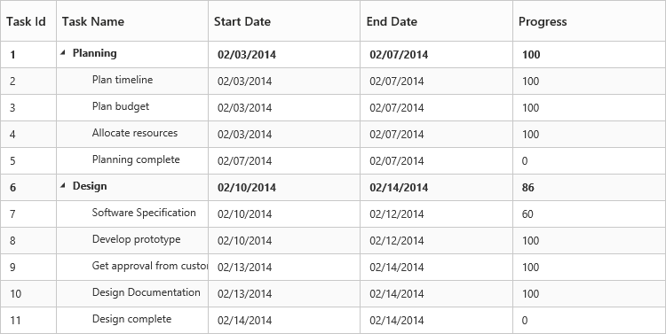
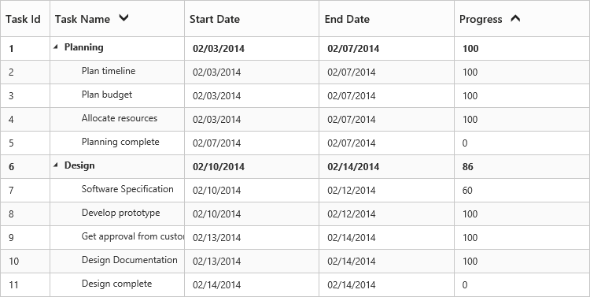
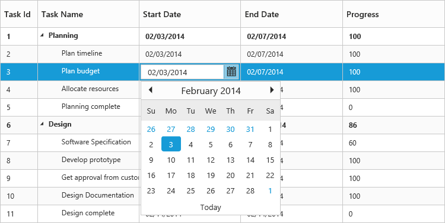

# Getting Started

## Create your first TreeGrid in ASP.NET Core 

This section explains you on how to create the TreeGrid control in your application with hierarchical data source and enable the sorting and editing in TreeGrid control. The following screenshot illustrates a TreeGrid. 

1. Create Syncfusion ASP.NET core Application. You can refer the [ASP.NET core Getting Started documentation](https://help.syncfusion.com/aspnet-core/gettingstarted/getting-started-1-0-1) to create new project and add necessary DLL’s and script files.

2. Add a TreeGrid Control in index.cshtml page with an empty datasource like as follows.

  
   ~~~ cshtml

	<ej-tree-grid id="TreeGridContainer" child-mapping="Children" tree-column-index="1"
               is-responsive="true">
    <e-tree-grid-columns>
        <e-tree-grid-column field="TaskId" header-text="Task Id" allow-filtering="false" edit-type="Numeric" width=45 />
        <e-tree-grid-column field="TaskName" header-text="Task Name" edit-type="String" />
        <e-tree-grid-column field="StartDate" header-text="Start Date" edit-type="Datepicker"  />
        <e-tree-grid-column field="EndDate" header-text="End Date" edit-type="Datepicker"  />
        <e-tree-grid-column field="Duration" header-text="Duration" edit-type="Numeric" />
        <e-tree-grid-column field="Progress" header-text="Progress" edit-type="Numeric" />        
    </e-tree-grid-columns>
    </ej-tree-grid>
   ~~~
  

3. Create data source for TreeGrid control

   ~~~ csharp

	public ActionResult TreeGridDefault()
	{
		ViewBag.datasource = this.GetEditingDataSource();
        ViewBag.toolbarItems = new List<String>(){"add","edit","delete","update","cancel","expandAll","collapseAll"};
        return View();
    }

	private List<BusinessObject> GetEditingDataSource()

	{

		List<BusinessObject> BusinessObjectCollection = new List<BusinessObject>();
        BusinessObject Record1 = null;
		Record1 = new BusinessObject()
		{
			TaskId = 1,
			TaskName = "Planning",
			StartDate = "02/03/2014",
			EndDate = "02/07/2014",
			Progress = 100,
			Duration = 5,
			Children=new List<BusinessObject>(),
		};
		BusinessObject Child1=new BusinessObject()
		{
			TaskId = 2,
			TaskName =  "Plan timeline",
			StartDate = "02/03/2014", 
			EndDate = "02/07/2014",  
			Duration = 5, 
			Progress = 100
		};
		BusinessObject Child2 = new BusinessObject()
		{
			TaskId = 3,
			TaskName = "Plan budget",
			StartDate = "02/03/2014",
			EndDate = "02/07/2014",
			Duration = 5,
			Progress = 100
		};
	   BusinessObject Child3 = new BusinessObject()
		{
			TaskId = 4,
			TaskName = "Allocate resources",
			StartDate = "02/03/2014",
			EndDate = "02/07/2014",			
            Duration = 5,
			Progress = 100
		};
		BusinessObject Child4 = new BusinessObject()
		{
			TaskId = 5,
			TaskName = "Planning complete",
			StartDate = "02/07/2014",
			EndDate = "02/07/2014",
			Duration = 0,
			Progress = 0
		};
		Record1.Children.Add(Child1);
		Record1.Children.Add(Child2);
		Record1.Children.Add(Child3);
		Record1.Children.Add(Child4);
		BusinessObject Record2 = new BusinessObject()
		{
			TaskId = 6,
			TaskName = "Design",
			StartDate = "02/10/2014",
			EndDate = "02/14/2014",
			Progress = 86,
			Duration = 3,
			Children = new List<BusinessObject>(),
		};
		BusinessObject Child5 = new BusinessObject()
		{
			TaskId = 7,
			TaskName = "Software Specification",
			StartDate = "02/10/2014",
			EndDate = "02/12/2014",
			Duration = 3,
			Progress = 60
		};
		BusinessObject Child6 = new BusinessObject()
		{
			TaskId = 8,
			TaskName = "Develop prototype",
			StartDate = "02/10/2014",
			EndDate = "02/12/2014",
			Duration = 3,
			Progress = 100
		};
		BusinessObject Child7 = new BusinessObject()
		{
			TaskId = 9,
			TaskName = "Get approval from customer",
			StartDate = "02/13/2014",
			EndDate = "02/14/2014",
			Duration = 2,
			Progress = 100
		};
		BusinessObject Child8 = new BusinessObject()
		{
			TaskId = 10,
			TaskName = "Design complete",
			StartDate = "02/14/2014",
			EndDate = "02/14/2014",
			Duration = 0,
			Progress = 0
		};
		Record2.Children.Add(Child5);
		Record2.Children.Add(Child6);
		Record2.Children.Add(Child7);
		Record2.Children.Add(Child8);
		BusinessObjectCollection.Add(Record1);
		BusinessObjectCollection.Add(Record2);
		return BusinessObjectCollection;
	}
	public class BusinessObject
	{
		public int TaskId
		{
		get;
		set;
		}
		public string TaskName
		{
		get;
		set;
		}
		public string StartDate
		{
		get;
		set;
		}
		public string EndDate
		{
		get;
		set;
		}
		public int Duration
		{
		get;
		set;
		}
		public int Progress
		{
		get;
		set;
		}
		public List<BusinessObject> Children
		{
		get;
		set;
		}
	}

   ~~~
  

4. Initialize the TreeGrid with data source.

   ~~~ cshtml

	<ej-tree-grid id="TreeGridContainer" datasource="ViewBag.datasource" child-mapping="Children" tree-column-index="1"
               is-responsive="true">
    <e-tree-grid-columns>
        <e-tree-grid-column field="TaskId" header-text="Task Id" allow-filtering="false" edit-type="Numeric" width=45 />
        <e-tree-grid-column field="TaskName" header-text="Task Name" edit-type="String" />
        <e-tree-grid-column field="StartDate" header-text="Start Date" edit-type="Datepicker"  />
        <e-tree-grid-column field="EndDate" header-text="End Date" edit-type="Datepicker"  />
        <e-tree-grid-column field="Duration" header-text="Duration" edit-type="Numeric" />
        <e-tree-grid-column field="Progress" header-text="Progress" edit-type="Numeric" />        
    </e-tree-grid-columns>
    </ej-tree-grid>
   ~~~
  

A TreeGrid is created as illustrated in the following screenshot

## Enable Sorting

The TreeGrid control contains sorting functionality to arrange the data in ascending or descending order based on a particular column.

## Multicolumn Sorting

You can enable the multicolumn sorting in TreeGrid by setting allow-multi-sorting as “true” .You can sort multiple columns in TreeGrid, by selecting the desired column header when holding the CTRL key.



<ej-tree-grid id="TreeGridContainer" 
         allow-sorting="true"
         allow-multi-sorting="true">
</ej-tree-grid>



## Enable Editing

You can enable Editing in TreeGrid using edit-settings API as illustrated in the following code example.



<ej-tree-grid id="TreeGridContainer" 
//...
 is-responsive="true">

  <e-tree-grid-edit-settings allow-deleting="true" allow-adding="true" allow-editing="true" 
            row-position="AboveSelectedRow" edit-mode="CellEditing" />
</ej-tree-grid>


You are also provided with the following editors’ support in TreeGrid control

* String
* Boolean
* Numeric
* Dropdown
* Datepicker
* DateTimePicker

You can set the editor type for particular column as illustrated in the following code example.



<ej-tree-grid id="TreeGridContainer" 
//...
is-responsive="true">

<e-tree-grid-columns>
        <e-tree-grid-column field="TaskId" header-text="Task Id" allow-filtering="false" edit-type="Numeric" width=45 />
        <e-tree-grid-column field="TaskName" header-text="Task Name" edit-type="String" />
        <e-tree-grid-column field="StartDate" header-text="Start Date" edit-type="Datepicker"  />
        <e-tree-grid-column field="EndDate" header-text="End Date" edit-type="Datepicker"  />
        <e-tree-grid-column field="Duration" header-text="Duration" edit-type="Numeric" />
        <e-tree-grid-column field="Progress" header-text="Progress" edit-type="Numeric" />        
    </e-tree-grid-columns>
    
</ej-tree-grid>



The output of the DateTimePicker editor in TreeGrid control is displayed as illustrated in the following screenshot.

