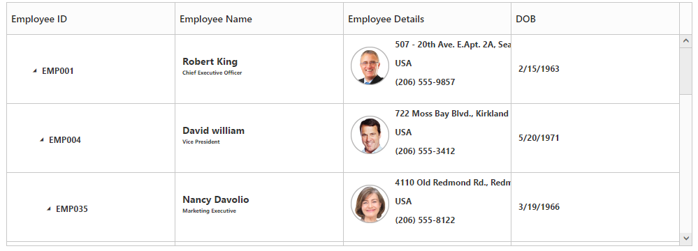
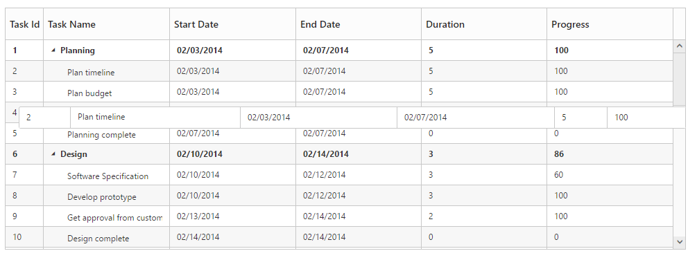

# Rows

The TreeGrid rows displays the information of each row from the bounded data source.

## Row Template

Row template is used to customize the TreeGrid rows based on requirements. In TreeGrid, RowTemplateID and AltRowTemplateID properties are used for customizing the row.

RowTemplateID is used to customize all the rows in TreeGrid. For this property, ID of the row template is to be provided.

AltRowTemplateID is used to customize the alternative rows in TreeGrid. For this property, ID of the alternative row template is to be provided.


 


    

    

    <ej-tree-grid id="TreeGridContainer" datasource="ViewBag.datasource" child-mapping="children" alt-row-template-id="altRowTemplateScript" row-template-id="rowTemplateScript">
        <e-tree-grid-size-settings width="100%" height="750px"></e-tree-grid-size-settings>
        <e-tree-grid-columns>
            <e-tree-grid-column field="EmployeeID" header-text="Employee ID" width=45 />
            <e-tree-grid-column field="Name" header-text="Name" />
            <e-tree-grid-column field="Address" header-text="Employee Details" />
            <e-tree-grid-column field="DOB" header-text="DOB" edit-type="Datepicker" />
        </e-tree-grid-columns>
    </ej-tree-grid>





public partial class TreeGridController : Controller
    {
        //
        // GET: /TreeGridRowTemplate/

        public ActionResult TreeGridRowTemplate()
        {
            var data = this.getRowData();
            ViewBag.datasource = data;
            return View();
        }

        private List<RowData> getRowData()
        {

            List<RowData> DataCollection = new List<RowData>();

            RowData Record1 = new RowData()
            {
                Name = "Robert King",
                FullName = "Robert King",
                Designation = "Chief Executive Officer",
                EmployeeID = "EMP001",
                Address = "507 - 20th Ave. E.Apt. 2A, Seattle",
                Contact = "(206) 555-9857",
                Country = "USA",
                DOB = "2/15/1963",
                DOJ = "5/1/1983",
                Children = new List<RowData>()
            };

            RowData parent = new RowData()
            {
                Name = "David William",
                FullName = "David William",
                Designation = "Vice President",
                EmployeeID = "EMP004",
                Address = "722 Moss Bay Blvd., Kirkland",
                Country = "USA",
                Contact = "(206) 555-3412",
                DOB = "5/20/1971",
                DOJ = "1/5/1991",
                Children = new List<RowData>()
            };

            RowData Child1 = new RowData()
           {
               Name = "Nancy Jennifer",
               FullName = "Nancy Jennifer",
               Designation = "Marketing Executive",
               EmployeeID = "EMP035",
               Address = "4110 Old Redmond Rd., Redmond",
               Country = "USA",
               Contact = "(206) 555-8122",
               DOB = "3/19/1966",
               DOJ = "1/5/1986",
               Children = new List<RowData>()
           };
            RowData Child2 = new RowData()
           {
               Name = "Romney Wilson",
               FullName = "Romney Wilson",
               Designation = "Sales Executive",
               EmployeeID = "EMP039",
               Address = "7 Hounds tooth Rd., London",
               Country = "UK",
               Contact = "(71) 555-3690",
               DOB = "02/02/1980",
               DOJ = "1/5/2000",
               Children = new List<RowData>()
           };

            RowData InnerChild1 = new RowData()
           {
               Name = "Andrew Fuller",
               FullName = "Andrew Fuller",
               Designation = "Sales Representative",
               EmployeeID = "EMP045",
               Address = "14 Garrett Hill, London",
               Country = "UK",
               Contact = "(71) 555-4848",
               DOB = "9/20/1980",
               DOJ = "1/5/2000",
           };

            RowData InnerChild2 = new RowData()
           {
               Name = "Anne Dodsworth",
               FullName = "Anne Dodsworth",
               Designation = "Sales Representative",
               EmployeeID = "EMP091",
               Address = "4726 - 11th Ave. N.E., Seattle",
               Country = "USA",
               Contact = "(206) 555-1189",
               DOB = "10/19/1989",
               DOJ = "1/5/2009",

           };
            RowData InnerChild3 = new RowData()
           {
               Name = "Michael Suyama",
               FullName = "Michael Suyama",
               Designation = "Sales Representative",
               EmployeeID = "EMP110",
               Address = "Coventry House Miner Rd., London",
               Country = "UK",
               Contact = "(71) 555-3636",
               DOB = "11/02/1987",
               DOJ = "1/5/2007",

           };
            RowData InnerChild4 = new RowData()
           {
               Name = "Janet Leverling",
               FullName = "Janet Leverling",
               Designation = "Sales Coordinator",
               EmployeeID = "EMP131",
               Address = "Edge ham Hollow Winchester Way, London",
               Country = "UK",
               Contact = "(71) 555-3636",
               DOB = "11/06/1990",
               DOJ = "1/5/2010",
           };

            RowData InnerChild5 = new RowData()
           {
               Name = "Margaret Peacock",
               FullName = "Margaret Peacock",
               Designation = "Sales Representative",
               EmployeeID = "EMP213",
               Address = "4726 - 11th Ave. N.E., California",
               Country = "USA",
               Contact = "(206) 555-1989",
               DOB = "01/21/1986",
               DOJ = "1/5/2006",
           };

            RowData InnerChild6 = new RowData()
           {
               Name = "Laura Callahan",
               FullName = "Laura Callahan",
               Designation = "Sales Coordinator",
               EmployeeID = "EMP201",
               Address = "Coventry House Miner Rd., London",
               Country = "UK",
               Contact = "(71) 555-2222",
               DOB = "12/01/1990",
               DOJ = "1/5/2010"
           };
            RowData InnerChild7 = new RowData()
           {
               Name = "Steven Buchanan",
               FullName = "Steven Buchanan",
               Designation = "Sales Representative",
               EmployeeID = "EMP197",
               Address = "200 Lincoln Ave, Salinas, CA 93901",
               Country = "USA",
               Contact = "(831) 758-7408",
               DOB = "03/23/1987",
               DOJ = "1/5/2007"

           };
            RowData InnerChild8 = new RowData()
           {
               Name = "Tedd Lawson",
               FullName = "Tedd Lawson",
               Designation = "Sales Representative",
               EmployeeID = "EMP167",
               Address = "200 Lincoln Ave, Salinas, CA 93901",
               Country = "USA",
               Contact = "(831) 758-7368 ",
               DOB = "08/09/1989",
               DOJ = "1/5/2009"
           };

            Record1.Children.Add(parent);
            parent.Children.Add(Child1);
            parent.Children.Add(Child2);
            Child1.Children.Add(InnerChild1);
            Child1.Children.Add(InnerChild2);
            Child1.Children.Add(InnerChild3);
            Child1.Children.Add(InnerChild4);

            Child2.Children.Add(InnerChild5);
            Child2.Children.Add(InnerChild6);
            Child2.Children.Add(InnerChild7);
            Child2.Children.Add(InnerChild8);
            DataCollection.Add(Record1);
            
            return DataCollection;

        }

        public class RowData
        {
            public string Name { get; set; }
            public string FullName { get; set; }
            public string Designation { get; set; }
            public string EmployeeID { get; set; }
            public string Address { get; set; }
            public string Contact { get; set; }
            public string DOB { get; set; }
            public string DOJ { get; set; }
            public string Country { get; set; }
            public List<RowData> Children { get; set; }

        }

    }

 

The output of TreeGrid with Row Template is as follows.

## Row Drag and Drop

It is possible to dynamically re-arrange the rows in the TreeGrid control by using the allow-drag-and-drop property. With this property, row drag can be enabled or disabled. Rows can be inserted above, below as a sibling or as a child to the existing row with the help of this feature. A default tooltip is rendered while dragging the TreeGrid row and this tooltip can be customized by the drag-tooltip property. This property has inner properties such as show-tooltip, tooltip-items and  tooltip-template

The ShowTooltip property is used to enable or disable the tooltip. By default, this property value is false.

The following code explains about enabling the row drag and drop with the default tooltip in the TreeGrid.



<ej-tree-grid id="TreeGridContainer" datasource="ViewBag.datasource" child-mapping="Children" allow-drag-and-drop="true">
    <e-tree-grid-drag-tooltip show-tooltip="true"></e-tree-grid-drag-tooltip>
    <e-tree-grid-columns>
    
    @*Add TreeGrid columns*@

    
     </e-tree-grid-columns>
</ej-tree-grid>    



The following screenshot depicts a row drag and drop in the TreeGrid.

## Customizing Drag tooltip

The tooltip-items property is used to customize the tooltip items. By using this property, specific fields can be rendered in the tooltip. By default this property value is null, and all the defined field items are rendered in the tooltip.

The following code shows how to render row drag tooltip with the desired field items



<ej-tree-grid id="TreeGridContainer" >
    <e-tree-grid-drag-tooltip show-tooltip="true" tooltip-items="new List<string>(){"TaskId","TaskName","StartDate","EndDate"} ></e-tree-grid-drag-tooltip>
</ej-tree-grid>  



The tooltip-template property renders the template tooltip for row drag and drop in the TreeGrid control by using the JsRender template. You can provide either the id value of the script element or the script element to the property.

The following code shows how to render row drag tooltip with tooltip template.	



<ej-tree-grid id="TreeGridContainer" >
    <e-tree-grid-drag-tooltip show-tooltip="true" tooltip-template="#customtooltip"></e-tree-grid-drag-tooltip>
</ej-tree-grid> 



## Multiple Row drag and drop

Using Multiple row drag and drop we can re-order multiple rows at a time.Using this we can drop the rows as above, below and child position as like single row drag and drop.
In TreeGrid we can enable the multiple drag and drop by setting `selection-type` as `Multiple` or  `Checkbox` and also we should enable the `allow-drag-and-drop`.

Please find the code example below to enable multiple drag and drop in TreeGrid.



<ej-tree-grid id="TreeGridContainer" datasource="ViewBag.datasource" child-mapping="Children" allow-drag-and-drop="true">
               //..
    <e-tree-grid-selection-settings selection-mode="Row" selection-type="Multiple"></e-tree-grid-selection-settings>   
</ej-tree-grid>    



We can also customize row drag and drop actions by using below properties

* canDrag – It is used to enable/disable the row drag action for draggedRecords collection in `row-drag-start` client side event.

* canDrop – It is used to enable/disable the row drop action for draggedRecords collection in `row-drop-action-begin` client side event. 

