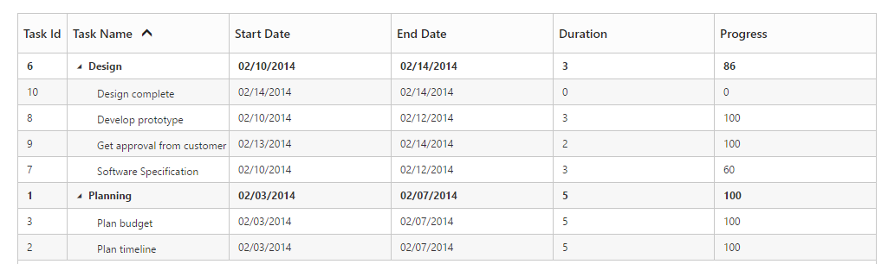

# Sorting

The TreeGrid control for JavaScript has built-in support for Sorting one or more columns.

## Sorting Columns

TreeGrid allows the items to be sorted in ascending or descending order based on the selected column by enabling the allow-sorting option in TreeGrid control. The following code example shows you how to enable Sorting in TreeGrid control.



<ej-tree-grid id="TreeGridContainer" allow-sorting="true">

</ej-tree-grid>  


## Multicolumn sorting

TreeGrid allows you to sort multiple columns by clicking the desired column headers while holding the CTRL key. The following code example shows you how to enable Multicolumn sorting in TreeGrid control.



<ej-tree-grid id="TreeGridContainer" datasource="ViewBag.datasource" child-mapping="Children" tree-column-index="1" allow-sorting="true" allow-multi-sorting="true">
    <e-tree-grid-columns>
        <e-tree-grid-column field="TaskId" header-text="Task Id" width=45/>
        <e-tree-grid-column field="TaskName" header-text="Task Name"/>
        <e-tree-grid-column field="StartDate" header-text="Start Date"  />
        <e-tree-grid-column field="EndDate" header-text="End Date" />
        <e-tree-grid-column field="Duration" header-text="Duration"/>
        <e-tree-grid-column field="Progress" header-text="Progress" />
    </e-tree-grid-columns>
</ej-tree-grid>  



The following screenshot shows the output of Multicolumn sorting in TreeGrid control.

