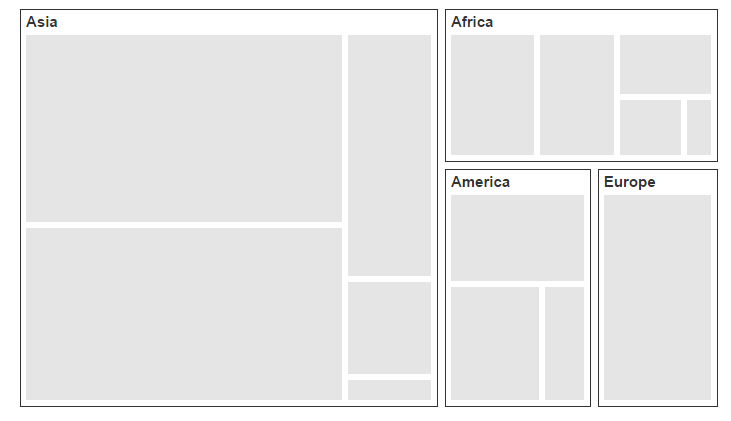
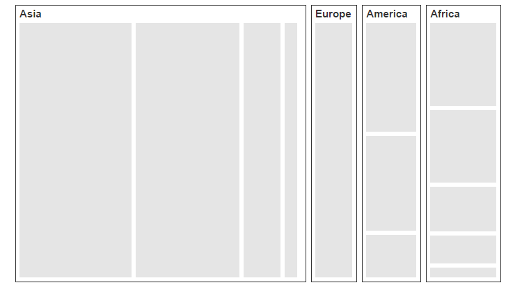
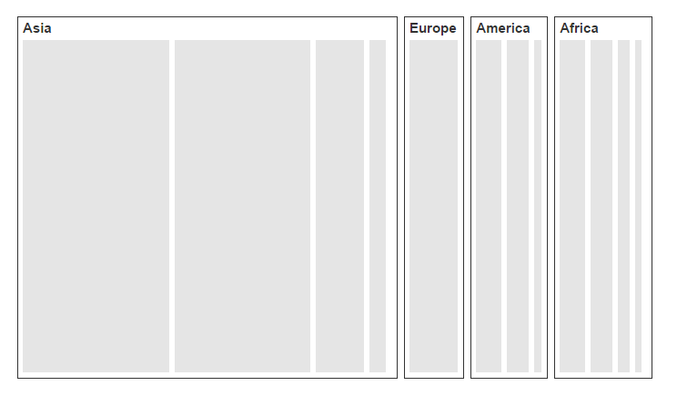
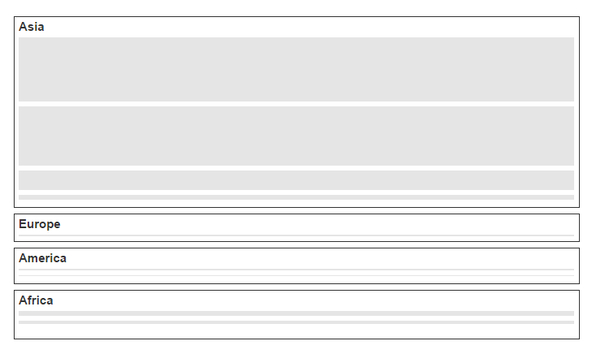

# Layout

You can decide on the visual representation of nodes belonging to all the treemap levels using the `ItemsLayoutMode` property of the TreeMap.

There are four different TreeMap layouts such as

* Squarified Layout
* SliceAndDiceAuto Layout
* SliceAndDiceHorizontal Layout
* SliceAndDiceVertical Layout

## Squarified Layout

`Squarified layout` creates rectangles with best aspect ratio.



	<ej-tree-map id="treemap" datasource="ViewBag.datasource" weight-value-path="Population" color-value-path="Growth" items-layout-mode="Squarified">
		<e-levels><e-level group-path="Continent" group-gap="5"></e-level></e-levels>
	</ej-tree-map>



## SliceAndDiceAuto Layout

`SliceAndDiceAuto` layout creates rectangles with high aspect ratio and displays them sorted both horizontally and vertically.



	<ej-tree-map id="treemap" datasource="ViewBag.datasource" weight-value-path="Population" color-value-path="Growth" items-layout-mode="SliceAndDiceAuto">
		<e-levels><e-level group-path="Continent" group-gap="5"></e-level></e-levels>
	</ej-tree-map>



## SliceAndDiceHorizontal Layout

`SliceAndDiceHorizontal` layout creates rectangles with high aspect ratio and displays them sorted horizontally.



	<ej-tree-map id="treemap" datasource="ViewBag.datasource" weight-value-path="Population" color-value-path="Growth" items-layout-mode="SliceAndDiceHorizontal">
		<e-levels><e-level group-path="Continent" group-gap="5"></e-level></e-levels>
	</ej-tree-map>



## SliceAndDiceVertical Layout

`SliceAndDiceVertical` layout creates rectangles with high aspect ratio and displays them sorted vertical.



	<ej-tree-map id="treemap" datasource="ViewBag.datasource" weight-value-path="Population" color-value-path="Growth" items-layout-mode="SliceAndDiceVertical">
		<e-levels><e-level group-path="Continent" group-gap="5"></e-level></e-levels>
	</ej-tree-map>



