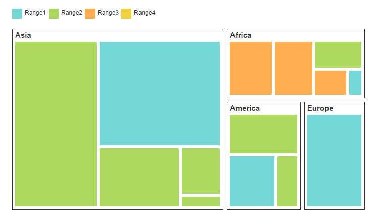
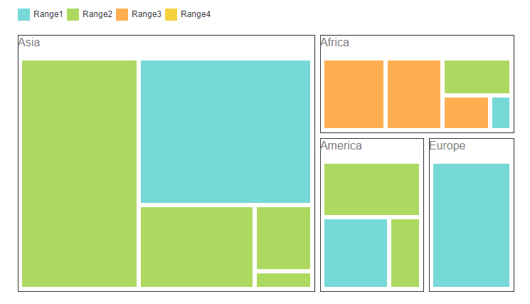
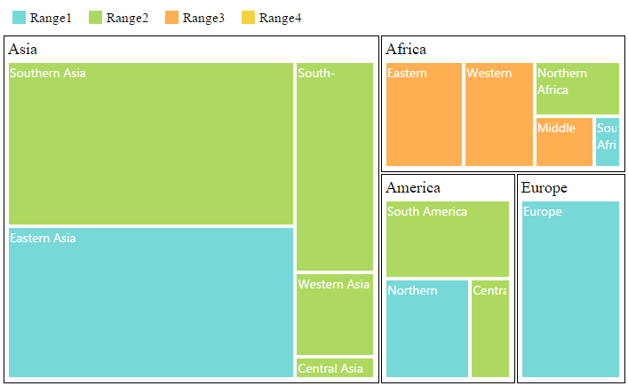

# TreeMap Elements

TreeMap contains various elements such as,

* Legend
* Headers
* Labels

## Legend

You can set the color value of leaf nodes using `TreeMapLegend`. This legend is appropriate only for the TreeMap whose leaf nodes are colored using `RangeColorMapping`.

You can set `ShowLegend` property value to “True” to enable or disable legend visibility.

### TreeMap Legend

You can decide the size of the legend icons by setting `IconWidth` and `IconHeight` properties of the `TreeMapLegend` property avail in TreeMap.

### Label for Legend

You can customize the labels of the legend item using `LegendLabel` property of `RangeColorMapping`. 



<ej-tree-map id="treemap" datasource="ViewBag.datasource" weight-value-path="Population" color-value-path="Growth" show-legend="true">
	<e-levels><e-level group-path="Continent" group-gap="5"></e-level></e-levels>
	<e-range-color-mappings>
		<e-range-color-mapping to="1" from="0" color="#77D8D8" legendlabel="Range1"></e-range-color-mapping>
		<e-range-color-mapping to="2" from="0" color="#AED960" legendlabel="Range2"></e-range-color-mapping>
		<e-range-color-mapping to="3" from="0" color="#FFAF51" legendlabel="Range3"></e-range-color-mapping>
		<e-range-color-mapping to="4" from="0" color="#F3D240" legendlabel="Range4"></e-range-color-mapping>
	</e-range-color-mappings>
	<e-legend-settings icon-height="20" icon-width="20"></e-legend-settings>
</ej-tree-map>



## Header

You can set headers for each level by setting the `ShowHeader` property of the each TreeMap levels. The `HeaderHeight` property helps to set the height of the header and Group path value determines the header value. You can customize the default header appearance by setting the `HeaderTemplate` of the TreeMap levels.



    <ej-tree-map id="treemap" highlight-border-brush="fdaa" datasource="ViewBag.datasource" color-value-path="Growth"
                 weight-value-path="Population" show-legend="true">
        <e-legend-settings icon-width="17" icon-height="17">
        </e-legend-settings>
        <e-levels>
            <e-level group-path="Continent" group-gap="5" header-height="30" header-template="headertemplate"></e-level>
        </e-levels>
        <e-range-color-mappings>
            <e-range-color-mapping from="0" to="1" color="#77D8D8" legendlabel="Range1"></e-range-color-mapping>
            <e-range-color-mapping from="0" to="2" color="#AED960" legendlabel="Range2"></e-range-color-mapping>
            <e-range-color-mapping from="0" to="3" color="#FFAF51" legendlabel="Range3"></e-range-color-mapping>
            <e-range-color-mapping from="0" to="4" color="#F3D240" legendlabel="Range4"></e-range-color-mapping>
        </e-range-color-mappings>
    </ej-tree-map>

   



## Customizing the header

The text in the header can be customized by triggering the event `HeaderTemplateRendering`of the **TreeMap**. This event is triggered before rendering the header template. 



    <ej-tree-map id="treemap" highlight-border-brush="fdaa" datasource="ViewBag.datasource" color-value-path="Growth"
                 weight-value-path="Population" show-legend="true" header-template-rendering="loadTemplate">
        <e-legend-settings icon-width="17" icon-height="17">
        </e-legend-settings>
        <e-levels>
            <e-level group-path="Continent" group-gap="5" header-height="30"></e-level>
        </e-levels>        
    </ej-tree-map>

   



## Label

You can also set labels for the leaf nodes by setting the `ShowLabels` property as true. `GroupPath` value is displayed as a label for leaf nodes. You can customize the default label appearance by setting the `LabelTemplate` of the TreeMap levels.



<ej-tree-map id="treemap" highlight-border-brush="fdaa" datasource="ViewBag.datasource" color-value-path="Growth" weight-value-path="Population" show-legend="true">
	<e-legend-settings icon-width="17" icon-height="17">
	</e-legend-settings>
	<e-levels>
		<e-level group-path="Continent" group-gap="5" header-height="30" header-template="headertemplate"></e-level>
	</e-levels>
	<e-range-color-mappings>
		<e-range-color-mapping from="0" to="1" color="#77D8D8" legendlabel="Range1"></e-range-color-mapping>
		<e-range-color-mapping from="0" to="2" color="#AED960" legendlabel="Range2"></e-range-color-mapping>
		<e-range-color-mapping from="0" to="3" color="#FFAF51" legendlabel="Range3"></e-range-color-mapping>
		<e-range-color-mapping from="0" to="4" color="#F3D240" legendlabel="Range4"></e-range-color-mapping>
	</e-range-color-mappings>
	<e-leaf-item-settings show-labels="true" label-path="Region" label-template="labeltemplate"></e-leaf-item-settings>
</ej-tree-map>



## Customizing the Overflow labels

You can handle the label overflow, by specifying any one of the following values to the property `textOverflow`as

**None**       - By specifying textOverflow as “none”, it displays the default label text.
**Hide**       - By specifying textOverflow as “hide”, You can hide the label, when it exceeds the header width.
**Wrap**       - By specifying textOverflow as “wrap”, you can wrap the label text.
**WrapByWord** - By specifying textOverflow as “WrapByWord”, you can wrap the label text by word.



<ej-tree-map id="treemap" highlight-border-brush="fdaa" datasource="ViewBag.datasource" color-value-path="Growth" weight-value-path="Population" show-legend="true">
	<e-legend-settings icon-width="17" icon-height="17">
	</e-legend-settings>
	<e-levels>
		<e-level group-path="Continent" group-gap="5" header-height="30" header-template="headertemplate"></e-level>
	</e-levels>	
	<e-leaf-item-settings show-labels="true" text-over-flow="Wrap"></e-leaf-item-settings>
</ej-tree-map>

