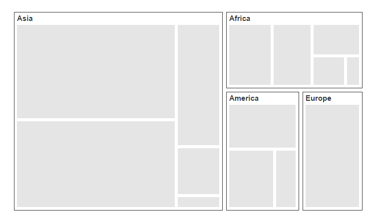
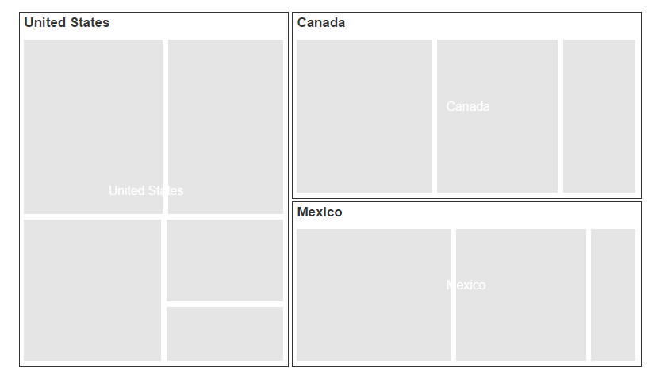

# TreeMapLevels

The levels of TreeMap can be categorized into two types as,

* FlatLevel
* Hierarchical Level

## Flat Level

### Group Path

You can use `GroupPath` property for every flat level of the TreeMap control. It is a path to a field on the source object that serves as the “Group” for the level specified. You can group the data based on the `GroupPath` in the TreeMap control. When the `GroupPath` is not specified, then the items are not grouped and the data is displayed in the order specified in the `DataSource`.

### Group Gap

You can use `GroupGap` property to separate the items from every flat level and to differentiate the levels mentioned in the TreeMap control.



    
    <ej-tree-map id="treemap" datasource="ViewBag.datasource" weight-value-path="Population" color-value-path="Growth">
        <e-levels><e-level group-path="Continent" group-gap="5"></e-level></e-levels>
    </ej-tree-map>



## Hierarchical Level

TreeMap `Hierarchical` level is used to define levels for hierarchical data collection that contains tree-structured data.




 

    <ej-tree-map id="container" datasource="ViewBag.hierarchicalData" color-value-path="Expense" weight-value-path="Sales">
        <e-levels>
            <e-level group-path="Country" header-height="25" show-labels="true"></e-level>
        </e-levels>
        <e-desaturation-color-mapping from="1" to="0.5" range-minimum="2000" range-maximum="8000">
        </e-desaturation-color-mapping>
    </ej-tree-map>





	public ActionResult Hierarchical()
	{
		ViewBag.hierarchicalData = SalesData.GetData();
		return View();
	}
	public class SalesData
	{
		public string Country { get; set; }
		public string Name { get; set; }
		public double Sales { get; set; }
		public double Expense { get; set; }

		public static List<SalesData> GetData()
		{
			List<SalesData> list = new List<SalesData>();
			list.Add(new SalesData() { Country = "United States", Name = "New York", Sales = 2353, Expense = 2000 });
			list.Add(new SalesData() { Country = "United States", Name = "Los Angeles", Sales = 3453, Expense = 3000 });
			list.Add(new SalesData() { Country = "United States", Name = "San Francisco", Sales = 8456, Expense = 8000 });
			list.Add(new SalesData() { Country = "United States", Name = "Chicago", Sales = 6785, Expense = 7000 });
			list.Add(new SalesData() { Country = "United States", Name = "Miami", Sales = 7045, Expense = 6000 });
			list.Add(new SalesData() { Country = "Canada", Name = "Toronto", Sales = 7045, Expense = 7000 });
			list.Add(new SalesData() { Country = "Canada", Name = "Vancouver", Sales = 4352, Expense = 4000 });
			list.Add(new SalesData() { Country = "Canada", Name = "Winnipeg", Sales = 7843, Expense = 7500 });
			list.Add(new SalesData() { Country = "Mexico", Name = "Mexico City", Sales = 7843, Expense = 6500 });
			list.Add(new SalesData() { Country = "Mexico", Name = "Cancun", Sales = 6683, Expense = 6000 });
			list.Add(new SalesData() { Country = "Mexico", Name = "Acapulco", Sales = 2454, Expense = 2000 });

			return list;
		}
	}



  

