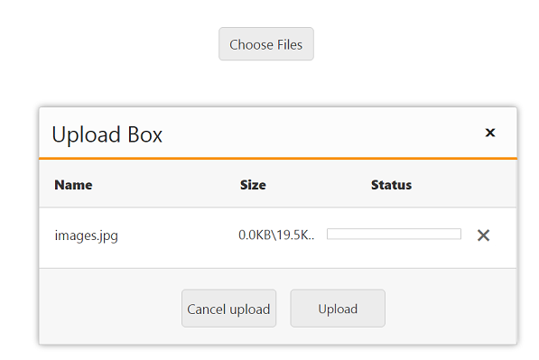
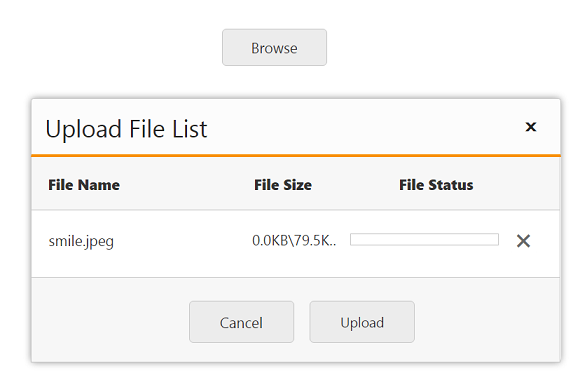
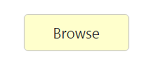

# Appearance and styling 

The UploadBox widget provides support to customize the dialog box text and button text. 

## Customizing Button Text

The following table contains the sub properties available under UploadBox ButtonText property. To customize the text, pass the alternate text with corresponding sub properties. 

_Sub-properties under buttonText property_

<table>
<tr>
<th>
Name</th><th>
Description</th><th>
Data Type</th></tr>
<tr>
<td>
Browse</td><td>
Sets the alternative text for browse button. </td><td>
String</td></tr>
<tr>
<td>
Upload</td><td>
Sets the alternative text for upload button. </td><td>
String</td></tr>
<tr>
<td>
Cancel</td><td>
Sets the alternative text for cancel button. </td><td>
String</td></tr>
</table>

The following steps explain the configuration of UploadBoxButtonText property in UploadBox. 

In the VIEW page, add the below code to configure the UploadBox element.



<ej-upload-box id="UploadDefault" save-url="//mvc.syncfusion.com/Services/FileUpload/UploadBox/saveFiles" remove-url="//mvc.syncfusion.com/Services/FileUpload/UploadBox/removeFiles">
    <e-button-text browse="Choose Files" cancel="Cancel upload" close="Upload file" />
</ej-upload-box>



The following screenshot displays the output.

## Customizing Upload Dialog

The following table contains the sub properties available under UploadBox DialogText property. To customize the text, pass the alternate text with corresponding sub properties. 

_Sub properties under dialogText property_

<table>
<tr>
<th>
Name</th><th>
Description</th></tr>
<tr>
<td>
Title</td><td>
Sets the alternative text for Title of UploadBox dialog. </td></tr>
<tr>
<td>
Name</td><td>
Sets the alternative text for Name column.  </td></tr>
<tr>
<td>
Size</td><td>
Sets the alternative text for Size column. </td></tr>
<tr>
<td>
Status</td><td>
Sets the alternative text for status column.</td></tr>
</table>

The following steps explain the configuration of UploadBoxDialogText property in UploadBox. 

In the VIEW page, add the below code to configure the UploadBox element.



<ej-upload-box id="UploadDefault" save-url="//mvc.syncfusion.com/Services/FileUpload/UploadBox/saveFiles" remove-url="//mvc.syncfusion.com/Services/FileUpload/UploadBox/removeFiles">
	<e-dialog-text title="Upload File List" name="File Name" size="File Size" status="File Status"/>
</ej-upload-box>



The following screenshot displays the output.

## Show or Hide File details 

The ShowFileDetails property is Boolean type, which allow us to show or hide file details in the uploaded file list dialog. To hide the uploaded file details, set ShowFileDetails property is set to ‘false’. By default value of ShowFileDetails property is set to ‘true’.

The following steps explains the configuration of ShowFileDetails property in UploadBox.

In the VIEW page, add the below code to configure the UploadBox element.



<ej-upload-box id="UploadDefault" save-url="//mvc.syncfusion.com/Services/FileUpload/UploadBox/saveFiles" remove-url="//mvc.syncfusion.com/Services/FileUpload/UploadBox/removeFiles" show-file-details="false">
</ej-upload-box>



## Theme

UploadBox control’s style and appearance are controlled based on CSS classes. In order to apply styles to the UploadBox control, you can refer to two files namely, ej.widgets.core.min.css and ej.theme.min.css. When the file ej.widgets.all.min.css is referred, then it is not necessary to include the files ej.widgets.core.min.css and ej.theme.min.css in your project, as ej.widgets.all.min.css is the combination of these both files. 

By default, there are 12-theme support available for UploadBox control namely,

* Default-theme
* Flat-azure-dark
* Fat-lime
* Flat-lime-dark
* Flat-saffron
* Flat-saffron-dark
* Gradient-azure
* Gradient-azure-dark
* Gradient-lime
* Gradient-lime-dark
* Gradient-saffron
* Gradient-saffron-dark

## Custom CSS

CssClass customizes the UploadBox control’s appearance. Define a CssClass as per the requirement and assign the class name to CssClass property. The data type is string. 

The following steps explain the configuration of CssClass property in UploadBox. 

1. In the View page, add the below code to configure the UploadBox element.



<ej-upload-box id="UploadDefault" save-url="//mvc.syncfusion.com/Services/FileUpload/UploadBox/saveFiles" remove-url="//mvc.syncfusion.com/Services/FileUpload/UploadBox/removeFiles" css-class="custom">
</ej-upload-box>


  
2. In CSS, configure Custom Styles for the UploadBox.
   

 
.custom.e-uploadbox.e-widget .e-selectpart.e-select {
	background-color: #FFFFCC;
	font-weight: bold;
	font-family: sans-serif;
}



The following screenshot displays the output.

