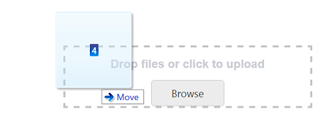
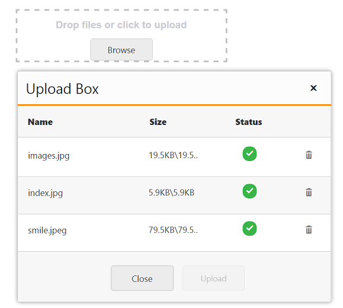
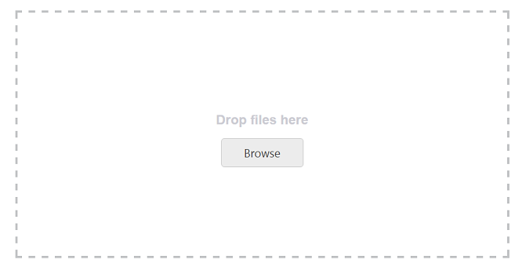

# Drag and Drop Support

The UploadBox control provides the drag and drop support. You can simply drag-and-drop files, directly from the computer and can be dropped into the droppable area. A list of files can be dragged and dropped when you enable the MultipleFilesSelection property.

The following screenshot displays the drag and drop support.

### Enable drag and drop 

AllowDragAndDrop property is Boolean type which allow us to enable or disable the Drag and Drop.  When you want to drag and drop multiple files, you can enable multiple file selection by setting MultipleFilesSelection as true in theUploadBox control. By default the AllowDragAndDrop property is set as false in the UploadBox control.

The following steps explain how to enable the drag and drop in the UploadBox control.

In the VIEW page, add the below code to enable the drag and drop in UploadBox control.



//Add the following code example to the corresponding CSHTML page to render UploadBox with drag and drop support
<ej-upload-box id="UploadDefault" save-url="//mvc.syncfusion.com/Services/FileUpload/UploadBox/saveFiles" remove-url="//mvc.syncfusion.com/Services/FileUpload/UploadBox/removeFiles" allow-drag-and-drop="true" multiple-files-selection="true"></ej-upload-box>

   

The following screenshot displays the output for the above code.

   

   ### Drag Area text

   You can change the drag area text by using the DragAreaText property.  By default, the DragAreaText (string) property is Drop files or click to upload in the UploadBox control.

   In the VIEW page, add the below code to enable the drag and drop in the UploadBox control.

   

	// Add the following code example to the corresponding CSHTML page to render UploadBox with drag and drop support
   <ej-upload-box id="UploadDefault" save-url="//mvc.syncfusion.com/Services/FileUpload/UploadBox/saveFiles" remove-url="//mvc.syncfusion.com/Services/FileUpload/UploadBox/removeFiles" allow-drag-and-drop="true" multiple-files-selection="true" drag-area-text="Drop files here"></ej-upload-box>

      

The following screenshot displays the output for the above code.

   

   ### Adjust Drop area size

   The UploadBox control provides the ability to change or adjust the drop area size. The DropAreaHeight andDropAreaWidth properties in the UploadBox control allows you to set the maximum height and maximum width for the drop area. The value set to this property is string or number type.

   The following steps explain you on how to adjust the Drop Area Size.

   In the VIEW page, add the below code to enable the drag and drop in UploadBox control.

   

	// Add the following code example to the corresponding CSHTML page to render UploadBox with drag and drop support.
   <ej-upload-box id="UploadDefault" save-url="//mvc.syncfusion.com/Services/FileUpload/UploadBox/saveFiles" remove-url="//mvc.syncfusion.com/Services/FileUpload/UploadBox/removeFiles" allow-drag-and-drop="true" multiple-files-selection="true" drag-area-text="Drop files here" drop-area-height="300px" drop-area-width="600px"></ej-upload-box>

      
  

The following screenshot displays the output for the above code.

   

   ### Drop area with Browse button behavior

   You can click anywhere in the droppable area to browse and upload the files. The droppable area behaves like a browse button.

   Enable the AllowDragAndDrop property to achieve this feature. Next, set the ShowBrowseButton as false in UploadBox Control.

   The following steps explains the droppable area containing the browse button behavior

   In the VIEW page, add the below script to enable drag and drop in the UploadBox control.

   

	//Add the following code example to the corresponding CSHTML page to render UploadBox with drag and drop support.

   <ej-upload-box id="UploadDefault" save-url="//mvc.syncfusion.com/Services/FileUpload/UploadBox/saveFiles" remove-url="//mvc.syncfusion.com/Services/FileUpload/UploadBox/removeFiles" allow-drag-and-drop="true" multiple-files-selection="true" show-browse-button="false"></ej-upload-box>

       

The following screenshot displays the output for the above code.

 