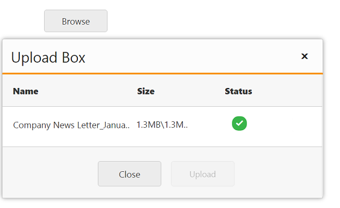

# File Actions

## Save File Action 

To save the uploaded file in ASP.NET Core, create an ActionResult and trigger the same in SaveUrl property.  In ActionResult, save and specify the target location as App_Data folder for the uploaded files. The data type is string.

The following steps explain the configuration of SaveUrl property in the UploadBox. 

In the VIEW page, add the below code to configure the UploadBox element.



<ej-upload-box id="UploadDefault" save-url="UploadFiles"></ej-upload-box>
		
   



private IHostingEnvironment hostingEnv;

public HomeController(IHostingEnvironment env)
{
	this.hostingEnv = env;
}
public IActionResult UploadFiles(IList<IFormFile> UploadDefault)
{
	long size = 0;
	foreach (var file in UploadDefault)
	{
		var filename = ContentDispositionHeaderValue
						.Parse(file.ContentDisposition)
						.FileName
						.Trim('"');
		filename = hostingEnv.WebRootPath + $@"\{filename}";
		size += file.Length;
		using (FileStream fs = System.IO.File.Create(filename))
		{
			file.CopyTo(fs);
			fs.Flush();
		}
	}
	return Content("");
}
public IActionResult Index()
{
	return View();
}



The following screenshot displays the output. 

## AutoUpload

The UploadBox widget provides support to upload the file automatically once file is selected by using Browse button, that is, without clicking upload button. To achieve this, set the AutoUpload property to ‘true’. The data type is Boolean. By default, the value is set to ‘false’, so Upload button is clicked to upload the files. 

The following code explains the configuration of AutoUpload property in UploadBox



<ej-upload-box id="UploadDefault" save-url="//mvc.syncfusion.com/Services/FileUpload/UploadBox/saveFiles" remove-url="//mvc.syncfusion.com/Services/FileUpload/UploadBox/removeFiles" auto-upload="true"></ej-upload-box>

   

