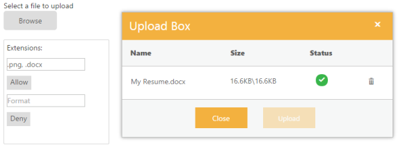
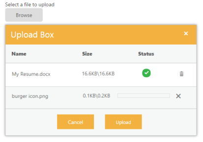
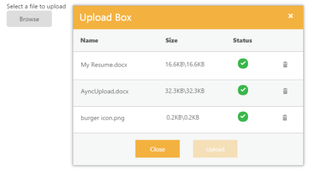

# Getting Started with ASP.NET Core UploadBox

This section explains about how to create an UploadBox in ASP.NET Core application .

## Create your first UploadBox in ASP.NET Core

The ASP.NET Core UploadBox supports upload of files or photos to your web page. In this section, you can learn how to upload a file  used in resume Upload scenario. This restricts some file extensions while uploading the resume in the server by using UploadBox control.

You can upload a resume allowing .png and .docx file extensions, and avoid unsupported resume formats to be uploaded to the server.The following screenshot demonstrates the functionality of UploadBox with file extension.

### Create UploadBox widgets

The UploadBox basically renders built-in features like upload and delete. You can know the status of the file(whether it is completed or failed) and also  retry upload if it failed. 

You can create a Core Project and add necessary assembly and script with the help of the given [Dotnet Core-Getting Started](https://help.syncfusion.com/aspnet-core/gettingstarted/getting-started-1-1-0) Documentation.

Add the following code example to the corresponding view page to render the UploadBox.



/*ej-Tag Helper code to render Uploadbox*/

<ej-upload-box id="UploadDefault" save-url="//mvc.syncfusion.com/Services/FileUpload/UploadBox/saveFiles" remove-url="//mvc.syncfusion.com/Services/FileUpload/UploadBox/removeFiles"></ej-upload-box>





/*Razor code to render Uploadbox*/

@Html.EJ().Uploadbox("UploadDefault").SaveUrl(@Url.Action("SaveDefault")).RemoveUrl(@Url.Action("RemoveDefault"))



N> To render the Uploadbox Control, use either Razor or Tag helper code as given in the previous code sample.

Using the code sample, execute the project to render the following output. The file is being uploaded. 

UploadBox after uploading
{:.caption}

## Set Restriction for File Extension

In a real-time scenario, some file extensions are restricted. You can either allow files or restrict files by using **extensionsAllow** and **extensionsDeny** respectively in **Uploadbox**. 

Add the following elements to the view page. 



/*ej-Tag Helper code to render Uploadbox*/

    <table id="uploadTable">
        <tr>
            <td>
                Extensions:
            </td>
            <td></td>
        </tr>
        <tr>
            <td>
                <input type="text" id="fileallow" class="ejinputtext" placeholder="Format" /> 
                 <ej-button id="upbutton1" text="Allow" click="allowfiletype"/>
            </td>
            <td></td>
        </tr>
        <tr>
            <td>
                <input type="text" id="filedeny" class="ejinputtext" placeholder="Format" /> 
                 <ej-button id="upbutton2" text="Deny" click="denyfiletype"/>
            </td>
            <td> 
               <ej-upload-box id="UploadDefault" save-url="//mvc.syncfusion.com/Services/FileUpload/UploadBox/saveFiles" remove-url="//mvc.syncfusion.com/Services/FileUpload/UploadBox/removeFiles"></ej-upload-box>         
            </td>
        </tr>
    </table>





/*Razor code to render Uploadbox*/

    <table id="uploadTable">
        <tr>
            <td>
                Extensions:
            </td>
            <td></td>
        </tr>
        <tr>
            <td>
                <input type="text" id="allow" class="ejinputtext" placeholder="Format" />
                @(Html.EJ().Button("upbutton1").Text("Allow").ClientSideEvents(c => c.Click("allow")))
            </td>
            <td></td>
        </tr>
        <tr>
            <td>
                <input type="text" id="deny" class="ejinputtext" placeholder="Format" />
                @(Html.EJ().Button("upbutton2").Text("Deny").ClientSideEvents(c => c.Click("deny")))
            </td>
            <td>
               @Html.EJ().Uploadbox("UploadDefault").SaveUrl(@Url.Action("SaveDefault")).RemoveUrl(@Url.Action("RemoveDefault")))
            </td>
        </tr>
    </table>



Add the following code example in script section.



 var upload;
    $(function () {
        upload = $("#UploadDefault").data("ejUploadbox");
        $("#upbutton1").ejButton({
            click: "allow",
        });
        $("#upbutton2").ejButton({
            click: "deny",
        });
    });
    function allow() {
        upload.option('extensionsAllow', $("#allow").val());
        upload.option('extensionsDeny', "");
    }
    function deny() {
        upload.option('extensionsAllow', "");
        upload.option('extensionsDeny', $("#deny").val());
    }



Add the given styles to display the **Uploadbox** with margin alignments.



    #targetElement {
        width: 520px;
        height: 500px;
        margin: 0 auto;
    }
    #UploadDefault {
        float: right;
    }
    #uploadTable {
        width: 100%;
    }
    #allow, #deny {
        width: 150px;
        height: 20px;
        padding: 5px;
    }



N> You can restrict one or more extension files by specifying file extension separated by comma (,)

The following screenshot displays an **Uploadbox** control with the file extension that allows “.**docx**” and “**.png”** files. .

 

### Upload Multiple Files

To upload multiple files in UploadBox control, click the Browse button and select multiple files from file explorer window



/*ej-Tag Helper code to render Uploadbox*/

<ej-upload-box id="UploadDefault" save-url="//mvc.syncfusion.com/Services/FileUpload/UploadBox/saveFiles" remove-url="//mvc.syncfusion.com/Services/FileUpload/UploadBox/removeFiles" multiple-files-selection="true"></ej-upload-box>





/*Razor code to render Uploadbox*/

@Html.EJ().Uploadbox("UploadDefault").SaveUrl(@Url.Action("Save")).RemoveUrl(@Url.Action("Remove")).MultipleFilesSelection(true)



The following screenshot displays an upload box control with multiple files selected:

