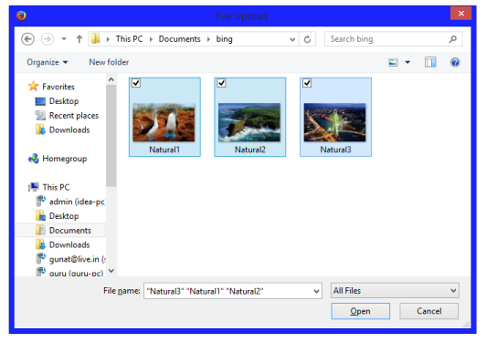
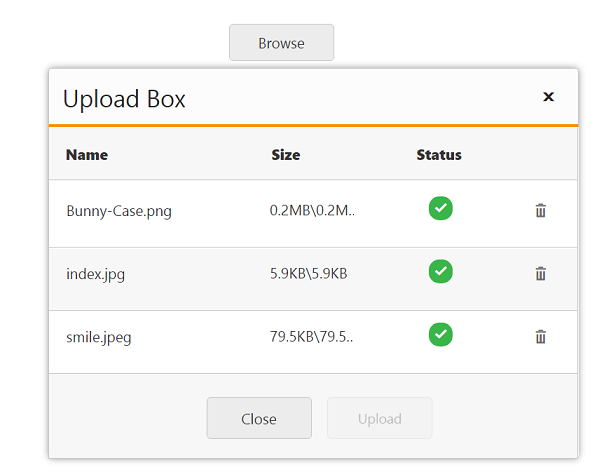

# Multiple files upload

The UploadBox widget provides support to upload multiple files spontaneously. The MultipleFilesSelection property enables you to select multiple files while browsing.  To achieve this, set the MultipleFilesSelection property to ‘true’. The data type is Boolean.

N> The Multiple file selection supports all the latest versions of browser except Internet Explorer 9 and its previous versions.

The following steps explain the configuration of MultipleFilesSelection property in UploadBox. 

In the VIEW page, add the below code  to configure the UploadBox element.



<ej-upload-box id="UploadDefault" save-url="//mvc.syncfusion.com/Services/FileUpload/UploadBox/saveFiles" remove-url="//mvc.syncfusion.com/Services/FileUpload/UploadBox/removeFiles" multiple-files-selection="true"></ej-upload-box>



The following screenshot displays the output.

