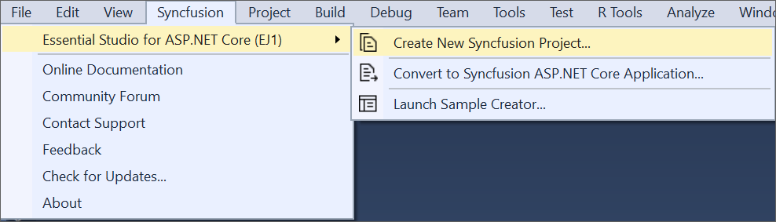
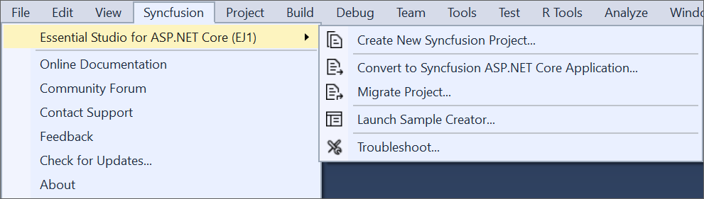

# Overview

The Syncfusion ASP.NET Core (Essential JS 1) Visual Studio Extensions can be accessed through the Syncfusion Menu to create and configure the project with Syncfusion references in Visual Studio.The Syncfusion ASP.NET Core Extensions supports Microsoft Visual Studio 2017.

I> The Syncfusion ASP.NET Core (Essential JS 1) menu option is available from v17.1.0.32.

The Syncfusion provides the following extension supports in Visual Studio:

1.	[Create Project](https://help.syncfusion.com/aspnet-core/Visual-Studio-Integration/Visual-Studio-Extensions/Create-Project): Creates the Syncfusion ASP.NET Core (Essential JS 1) application by adding the required Essential JS 1 components.
2.	[Convert Project](https://help.syncfusion.com/aspnet-core/Visual-Studio-Integration/Visual-Studio-Extensions/Convert-Project): Converts an existing ASP.NET Core application into a Syncfusion ASP.NET Core (Essential JS 1) application by adding the required Syncfusion assemblies and resource files.
3.	[Upgrade Project](https://help.syncfusion.com/aspnet-core/Visual-Studio-Integration/Visual-Studio-Extensions/Upgrade-Project): Upgrades the existing Syncfusion ASP.NET Core (Essential JS 1) application from one Essential Studio version to another.
4.	[Create Samples](https://help.syncfusion.com/aspnet-core/Visual-Studio-Integration/Visual-Studio-Extensions/Create-Samples): Creates the Syncfusion ASP.NET Core (Essential JS1) application with the sample code of required controls and features.
5.	[Troubleshooting](https://help.syncfusion.com/aspnet-core/Visual-Studio-Integration/Visual-Studio-Extensions/Troubleshooting): Troubleshoots the project with the Syncfusion configuration and apply the fix like, wrong Framework Syncfusion assembly added to the project or missing any Syncfusion dependent assembly of a referred assembly.

**No project selected in Visual Studio**

**Selected Microsoft ASP.NET Core application in Visual Studio**

**Selected Syncfusion ASP.NET Core (Essential JS1) application in Visual Studio**

N> In Visual Studio 2019, Syncfusion menu is available under Extensions in Visual Studio menu.

