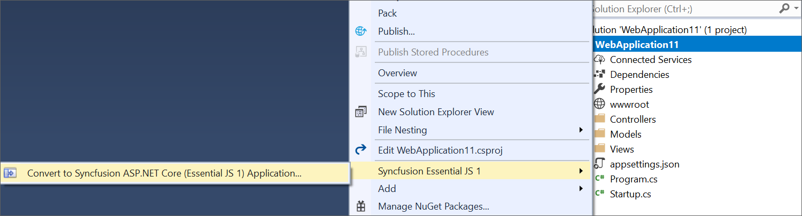
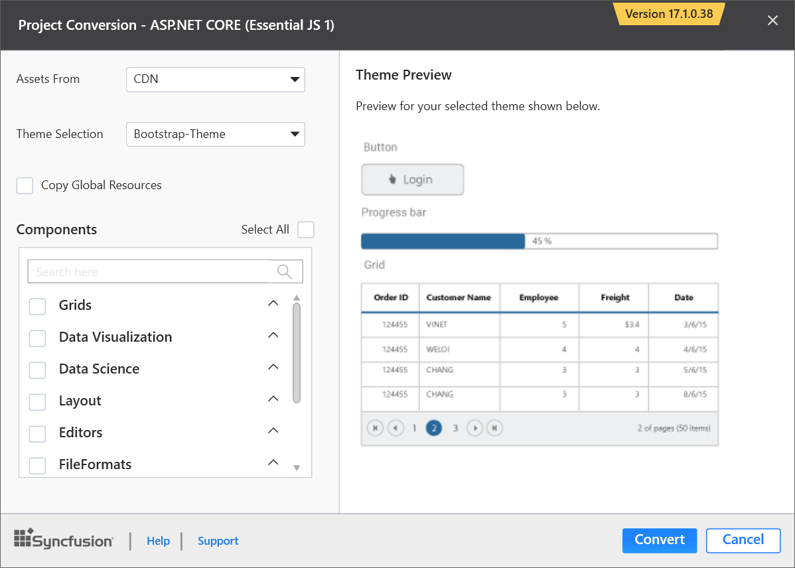
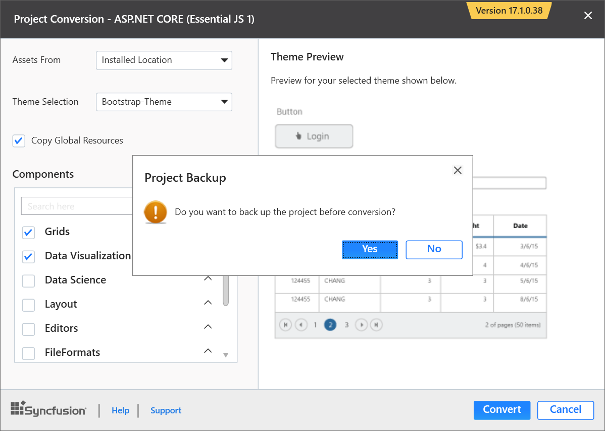

# ASP.NET Core Convert Project 

Syncfusion project conversion is a Visual Studio add-in that converts an existing ASP.NET Core application into the Syncfusion ASP.NET Core (Essential JS 1) Web application by adding the required assemblies and resource files.

I> The Syncfusion ASP.NET Core Web Application Project Conversion utility is available from v15.2.0.40. 

The following steps help you use the Syncfusion Project conversion in the existing ASP.NET Core Web Application:

> Before use, the Syncfusion ASP.NET Core (Essential JS 1) Project Conversion, check whether the **Syncfusion Essential JS1 AspNet Core VSExtensions** installed or not in Visual Studio Extension Manager by clicking on the Tools -> Extensions and Updates -> Installed for Visual Studio 2017 or lower and for Visual Studio 2019 by clicking on the Extensions -> Manage Extensions -> Installed. Also, check whether the corresponding Essential Studio version build installed or not. If the Essential Studio version is not same for both the Extension and build, then the Project Conversion will not be shown.

1. Open an existing Microsoft ASP.NET Core Web Application or create a new Microsoft ASP.NET Core Web Application. 

2. Open the conversion dialog by either one of the options below: 

   **Option 1**  
   Click **Syncfusion Menu** and choose **Essential Studio for ASP.NET Core (EJ1) > Convert to Syncfusion ASP.NET Core Application…** in **Visual Studio**.

   

   N> In Visual Studio 2019, Syncfusion menu is available under Extensions in Visual Studio menu.

   **Option 2**  
   Right-click the Project from Solution Explorer, select **Syncfusion Essential JS 1**, and choose **Convert to Syncfusion ASP.NET Core (Essential JS 1) Application...** Refer to the following screenshot for more information.

   

3. Project Conversion wizard opens to configure the project.

   

   **Assets From:** Load the Syncfusion assets to ASP.NET Core Project, either CDN or Installed Location.
   
   **Theme Selection:** The master page of project will be updated based on selected theme. The Theme Preview section shows the controls preview before convert into a Syncfusion project.
   
   

   **Copy Global Resources:** If choose Copy Global Resources option, the Syncfusion localization culture files will be shipped to project from Installed Location.

     

   **Components:** Choose the required Syncfusion controls.

    

4. The **Project Backup** dialog will appear when click the **Convert** button. In the dialog, if click **Yes**, it will backup the current project before converting into Syncfusion project. If click **No**, it will convert the project to Syncfusion project without backup.

   

5. The required Syncfusion NuGet packages, Scripts, and CSS have been added to the project.

   

   

6. If you installed the trial setup or NuGet packages from nuget.org you have to register the Syncfusion license key to your project since Syncfusion introduced the licensing system from 2018 Volume 2 (v16.2.0.41) Essential Studio release. Navigate to the [help topic](https://help.syncfusion.com/common/essential-studio/licensing/license-key#how-to-generate-syncfusion-license-key) to generate and register the Syncfusion license key to your project. Refer to this [blog](https://blog.syncfusion.com/post/Whats-New-in-2018-Volume-2-Licensing-Changes-in-the-1620x-Version-of-Essential-Studio.aspx?_ga=2.11237684.1233358434.1587355730-230058891.1567654773) post for understanding the licensing changes introduced in Essential Studio.