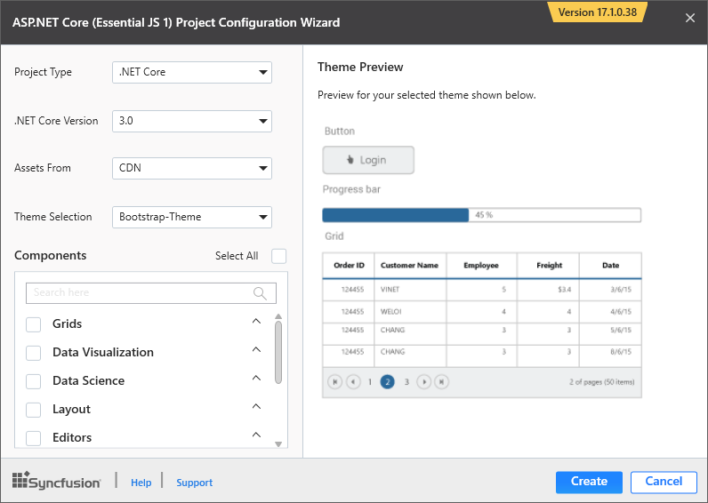
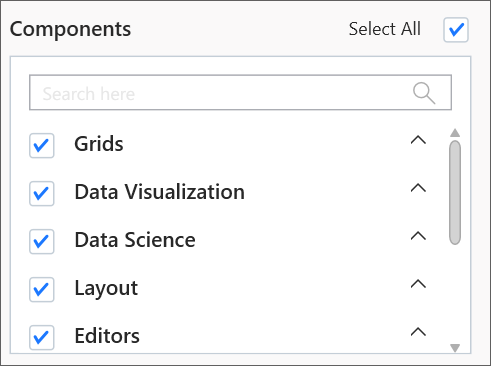
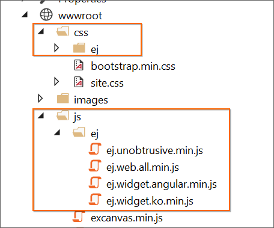

# Create ASP.NET Core application

Syncfusion provides the **Visual Studio Project Templates** for the Syncfusion ASP.NET Core platform to create the Syncfusion ASP.NET Core Application with the Essential JS 1 components.  

I> The Syncfusion ASP.NET Core project templates are available from v15.2.0.40.  

Use the following steps to create the **Syncfusion ASP.NET Core (Essential JS 1) Application** through the **Visual Studio Project Template**:

> Before use the Syncfusion ASP.NET Core (Essential JS 1) Project Template, check whether the **Syncfusion Essential JS1 AspNet Core VSExtensions** installed or not in Visual Studio Extension Manager by clicking on the Tools -> Extensions and Updates -> Installed for Visual Studio 2017 or lower and for Visual Studio 2019 by clicking on the Extensions -> Manage Extensions -> Installed.

1. To create a Syncfusion ASP.NET Core (Essential JS 1) project, follow either one of the options below:

   **Option 1**   
   Click **Syncfusion Menu** and choose **Essential Studio for ASP.NET Core (EJ1) > Create New Syncfusion Project…** in **Visual Studio**.

   

   N>In Visual Studio 2019, Syncfusion menu is available under Extensions in Visual Studio menu.

   **Option 2**   
   Choose **File > New > Project** and navigate to **Syncfusion > .NET Core > Syncfusion ASP.NET Core (Essential JS 1) Web Application** in **Visual Studio**.

   

2. Name the **Project**, choose the destination location, and set the .NET Framework of the project, and then click **OK**. The Project Configuration Wizard appears.

   N> Minimum target Framework is 4.5.2 for Syncfusion ASP.NET Core Project Templates.
   
3. Choose the options to configure the Syncfusion ASP.NET Core (Essential JS 1) application by using the following Project Configuration dialog.
   
   

   **Project configurations**

   **Project Type:** Select the type of ASP.NET Core Project, either .NET Core or .NET Framework.

   **.NET Core Version:** Select the version of ASP.NET Core Project.

   

   **Assets From:** Load the Syncfusion assets to ASP.NET Core Project, either CDN or Installed Location.

   **Theme Selection:** Choose the required theme. The Theme Preview section shows the controls preview before convert into a Syncfusion project.

   

   **Components:** Choose the required Syncfusion components to configure.

   

4. Click **Create**, the Syncfusion ASP.NET Core (Essential JS 1) Application has been created.

5. The required Syncfusion NuGet packages, Scripts, and CSS have been added to the project.

   

   

6. Then, Syncfusion licensing registration required message box will be shown, if you installed the trial setup or NuGet packages since Syncfusion introduced the licensing system from 2018 Volume 2 (v16.2.0.41) Essential Studio release. Navigate to the  [help topic](https://help.syncfusion.com/common/essential-studio/licensing/license-key#how-to-generate-syncfusion-license-key), which is shown in the licensing message box to generate and register the Syncfusion license key to your project. Refer to this [blog](https://blog.syncfusion.com/post/Whats-New-in-2018-Volume-2-Licensing-Changes-in-the-1620x-Version-of-Essential-Studio.aspx) post for understanding the licensing changes introduced in Essential Studio.

      

