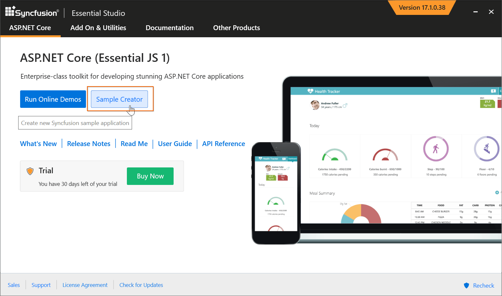
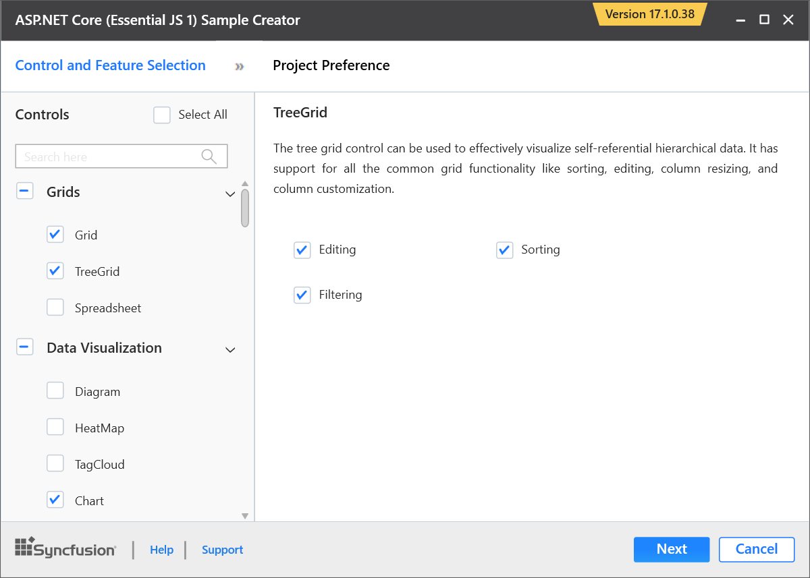
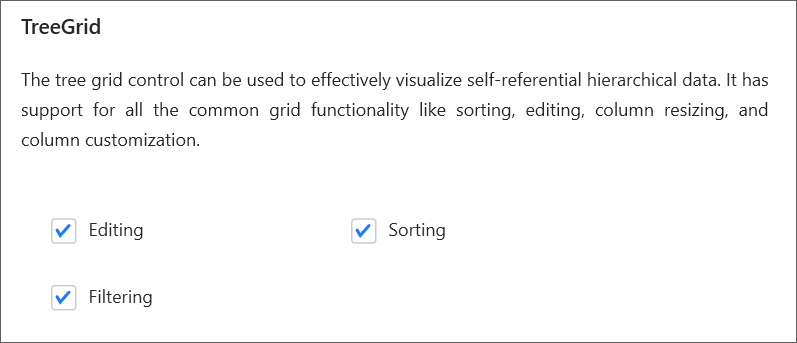
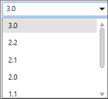
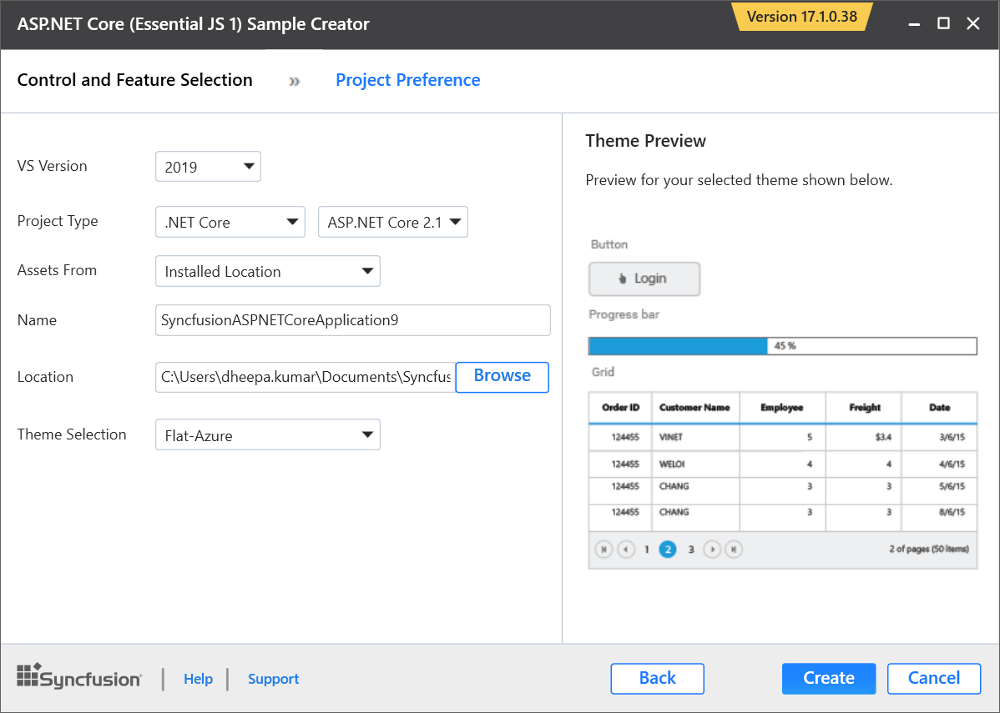
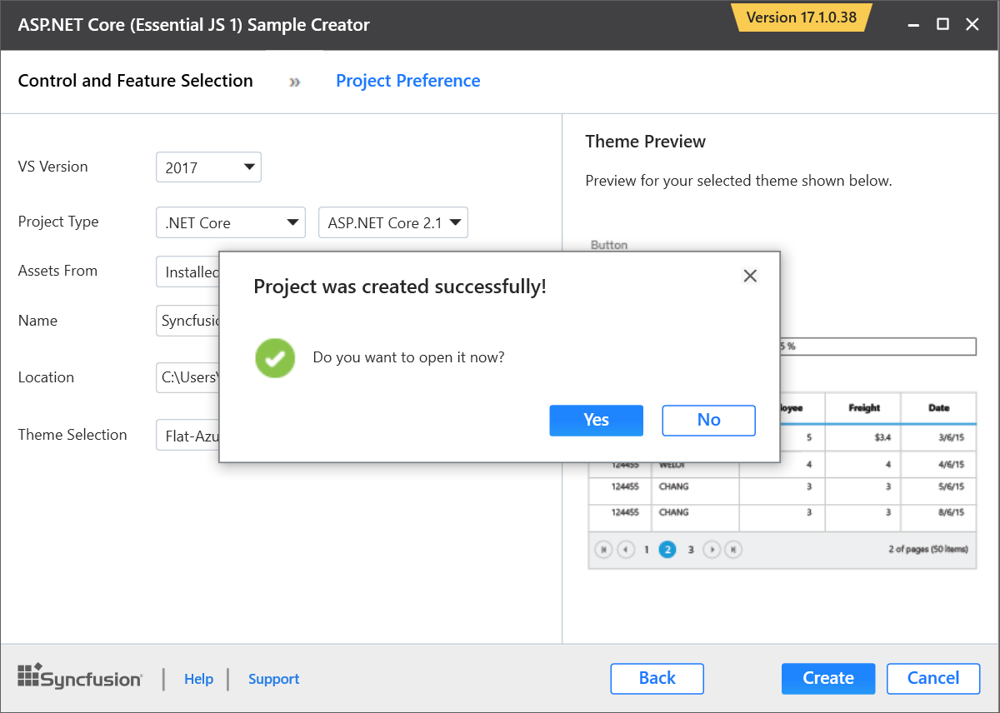
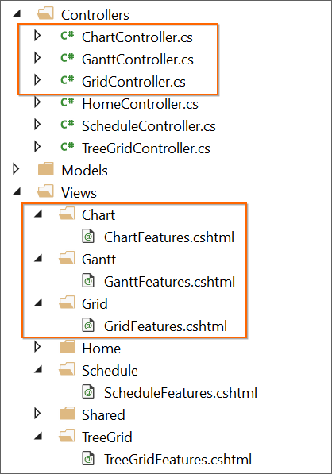
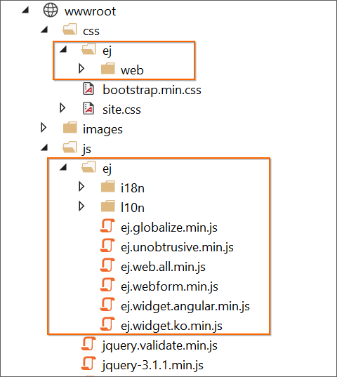
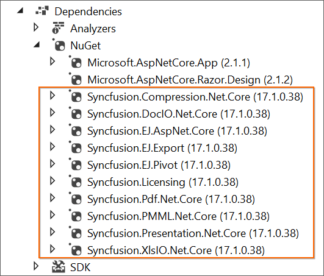

# Create Samples

The Syncfusion Sample Creator is a utility that allows you to create the Syncfusion ASP.NET Core (Essential JS 1) Projects with sample code of required Syncfusion component features and configuration of Syncfusion controls.

I> The Syncfusion ASP.NET Core Sample Creator utility is available from v15.2.0.40.

Use the following steps to create the Syncfusion ASP.NET Core (Essential JS 1) Application through the Sample Creator utility:

1. To launch ASP.NET Core (Essential JS 1) Sample Creator application, follow either one of the options below: 

   **Option 1:**   
   Click **Syncfusion Menu** and choose **Essential Studio for ASP.NET Core (EJ1) > Launch Sample Creator…** in **Visual Studio**.
   
   

   N> In Visual Studio 2019, Syncfusion menu is available under Extensions in Visual Studio menu.

   **Option 2:**  
   Launch the Syncfusion ASP.NET Core (Essential JS 1) Control Panel. Select the Sample Creator button to launch the ASP.NET Core (Essential JS 1) Sample Creator application. Refer to the following screenshot for more information.

   

2. ASP.NET Core (Essential JS 1) Sample Creator lists the Syncfusion controls and its features

   

   **Controls Selection:** Choose the required controls. The controls are grouped with Syncfusion products, and the controls are grouped product wise.

   

   **Feature Selection:** Based on the controls, the feature is enabled to choose the features of the corresponding controls.

   

   **Project configurations**

   1. You can configure the following project details in the Sample Creator.

      * **Project Type:** Select the type of ASP.NET Core Project, either .NET Core or .NET Framework.
   
      * **ASP.NET Core Version:** Select the version of ASP.NET Core Project.
        
        

      * **VS Version:** Choose the Visual Studio version.
   
      * **Assets From:** Load the Syncfusion assets to ASP.NET Core Project, either CDN or Installed Location.

      * **Name:** Name your Syncfusion ASP.NET Core Application.

      * **Location:** Choose the target location of your project.

      * **Theme Selection:** Choose the required theme. This section shows the controls preview before creating the Syncfusion project.

      

   2. Click **Create** button. After creating the project, open the project by clicking **Yes**. If you click **No**, the corresponding location of the project will be opened. Refer to the following screenshot for more information.

      

   3. The new Syncfusion ASP.NET Core (Essential JS 1) project is created with the resources.

   * Added the required Controllers and View files in the project.

     

   * Included the required Syncfusion ASP.NET Core (Essential JS 1) scripts and theme files.

     

   * Restored the required Syncfusion NuGet packages for selected controls under dependencies.

     
