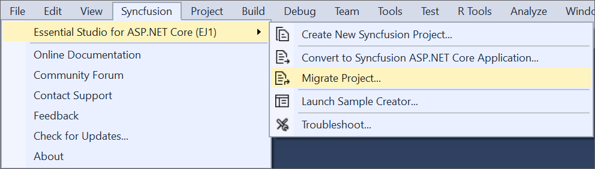
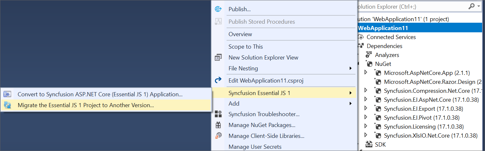

# ASP.NET Core Upgrade Project

Syncfusion Project Migration is a Visual Studio add-in that allows you to migrate the existing Syncfusion ASP.NET Core Web Application from one Essential Studio version to another.

I> The Syncfusion ASP.NET Core Web Application Project Migration utility is available from v15.2.0.40.

Use the following steps to migrate your existing Syncfusion ASP.NET Core Web Application: 

1. To open Migration Wizard, follow either one of the options below: 

   **Option 1**  
   Click **Syncfusion Menu** and choose **Essential Studio for ASP.NET Core (EJ1) > Migrate Project…** in **Visual Studio**.
   
   

   N> In Visual Studio 2019, Syncfusion menu is available under Extensions in Visual Studio menu.
   
   **Option 2**  
   Right-click the **Syncfusion ASP.NET Core Web Application** from Solution Explorer and select **Syncfusion Essential JS 1**. Choose **Migrate the Essential JS 1 Project to Another Version...**

   

2. The **Project Migration** window appears. You can choose the required Essential Studio version that is installed in the machine. 

   

3. The **Project Migration** window allows you to configure the following options:

   i. **Essential Studio Version:** Select any version from the list of installed versions.
   
   ii. **Assets From:** Load the Syncfusion assets to ASP.NET Core Project, either CDN or Installed Location.
   
4. Click the **Migrate** Button. The Project Backup dialog appears. In the dialog, if click **Yes**, it will backup the current project before migrating the Syncfusion project. If click **No**, it will migrate the project to required Syncfusion version without backup.
   
   
      
5. The Syncfusion NuGet packages, Scripts, and CSS are updated to the corresponding version in the project.

6. If you installed the trial setup or NuGet packages from nuget.org you have to register the Syncfusion license key to your project since Syncfusion introduced the licensing system from 2018 Volume 2 (v16.2.0.41) Essential Studio release. Navigate to the [help topic](https://help.syncfusion.com/common/essential-studio/licensing/license-key#how-to-generate-syncfusion-license-key) to generate and register the Syncfusion license key to your project. Refer to this [blog](https://blog.syncfusion.com/post/Whats-New-in-2018-Volume-2-Licensing-Changes-in-the-1620x-Version-of-Essential-Studio.aspx?_ga=2.11237684.1233358434.1587355730-230058891.1567654773) post for understanding the licensing changes introduced in Essential Studio.