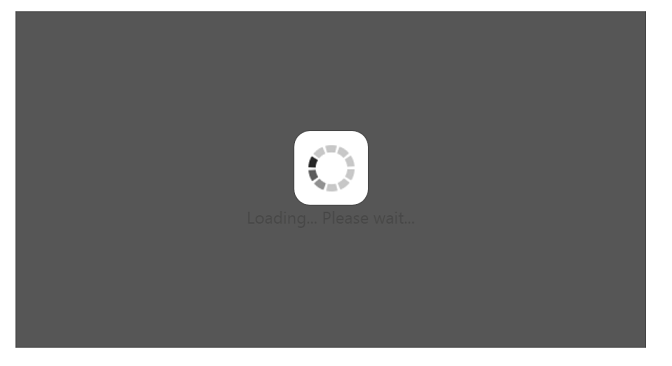
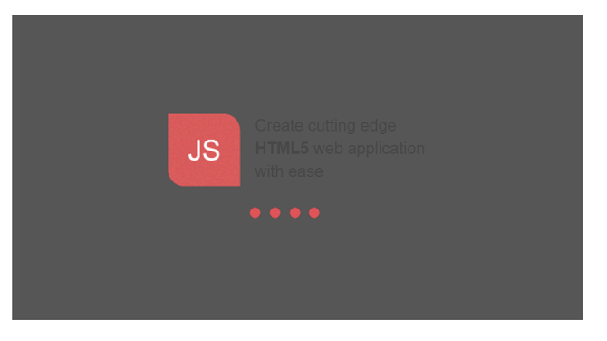
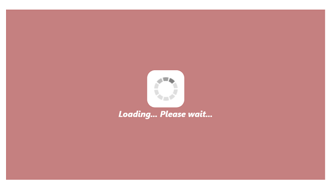

# Appearance and Styling 

## Custom Text

WaitingPopup control provides support for Custom Text to mention any message inside the pop-up panel.  You can specify a custom text through the option Text that displays when the Waiting Popup is loading.

The following steps explains you the configuration of the custom text for WaitingPopup control.

1. In the VIEW page, add the below code to render WaitingPopup widget.



        
    <ej-waiting-popup id="target" show-on-init="true" text="Loading... Please wait..." />



2. Add the following styles to render WaitingPopup widget.


   


   
Execute the above code to render the following output.

Custom Text in WaitingPopup
{:.caption}

### Template

WaitingPopup widget provides support for Template to customize the appearance of it by including HTML content instead of the default image.

The following steps explains you on how to define template to display a text and image for WaitingPopup control.

1. In the VIEW page, add the below code to configure WaitingPopup widget.



        
	<ej-waiting-popup id="target" show-on-init="true" template="#content"/>

	

	

	
Create cutting edge 

	
<b>HTML5</b> web application 

	
with ease 

	



2. In CSS, you can configure the custom styles for WaitingPopup.
    
N> Images for this sample are available ‘installed location /Content/images’ and we need to define images in mentioned CSS. Henceforth the images will display._





Execute the above code to render the following output.

WaitingPopup with Custom Template
{:.caption}

### CSS Class

You can use the CSS class to customize the WaitingPopup control appearance. Define a CSS class as per requirement and assign the class name to CssClass property.

The following steps allows you to configure CSS class for an auto-complete textbox.

1. In the VIEW page, add the below code to configure WaitingPopup widget.


   

	<ej-waiting-popup id="target" show-on-init="true" css-class="custom" text="Loading... Please wait..." />

 

2. Define CSS class for customizing the WaitingPopup widget.



 

The following screenshot displays the output for the above code.

WaitingPopup with customized CSS
{:.caption}