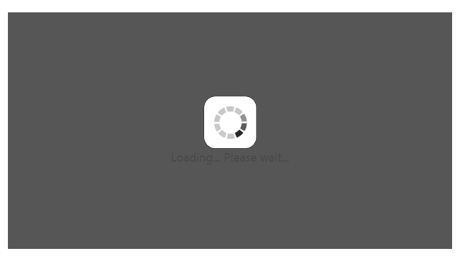
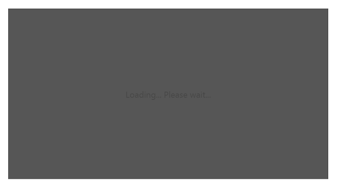

# Behavior and Settings

## Automatic Initializing WaitingPopup widget

WaitingPopup widget contains ShowOnInit property that allows the popup to display over a target on page load automatically. By default, ShowOnInit property is set as false.

The following steps explains you on how to display the WaitingPopup on page load.

1. In an VIEW page, add the below code to render WaitingPopup widget.


    

	<ej-waiting-popup id="target" show-on-init="true" />


   
2. Add the following styles to render WaitingPopup widget.



	


   
The following screenshot illustrates the WaitingPopup when ShowOnInit is set to “true”.

WaitingPopup with enabled showOnInit property
{:.caption}

### Enable / Disable Popup Indicator

You can show or hide the popup indicator of WaitingPopup widget using ShowImage property. By default, ShowImage property is set as true.

The following steps explains you to enable / disable popup indicator in WaitingPopup widget.

1. In the VIEW page, add the below code to render WaitingPopup widget.



Enable popup indicator:

	
	<ej-waiting-popup id="target" show-on-init="true" show-image="true" text="Loading... Please wait..."/>

Disable popup indicator:

	
	<ej-waiting-popup id="target" show-on-init="true" show-image="false" text="Loading... Please wait..."/>

   

2. Add the following styles to render WaitingPopup widget.




   
Execute the above code to render the following output.

Enabled popup indicator WaitingPopup widget
{:.caption}

Disabled popup indicator WaitingPopup widget
{:.caption}

## Show / Hide WaitingPopup

Using Show() and Hide() methods, you can display or hide the WaitingPopup widget over the target area.

The following steps explains you to show / hide the WaitingPopup widget.

1. In the VIEW page, add the below code to render WaitingPopup widget.



        
    <ej-waiting-popup id="target" show-on-init="true" /> 

	
Show WaitingPopup:

Hide WaitingPopup:

   
   
2. Add the following styles to render WaitingPopup widget.





The following screenshot illustrates a WaitingPopup when Show() method is invoked.

WaitingPopup with Show() method
{:.caption}