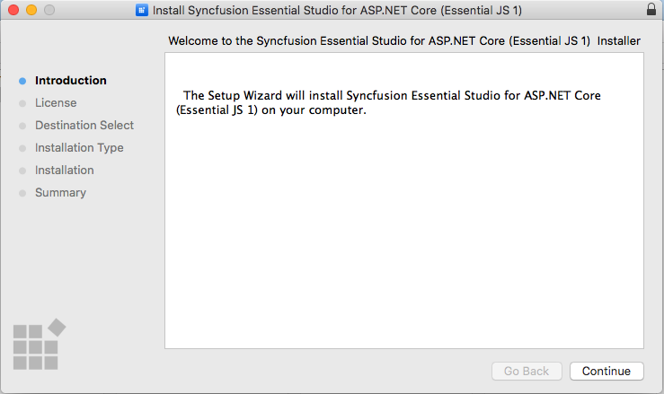
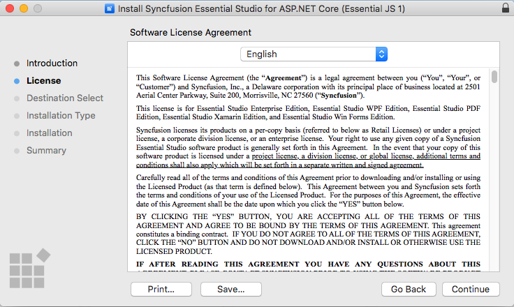
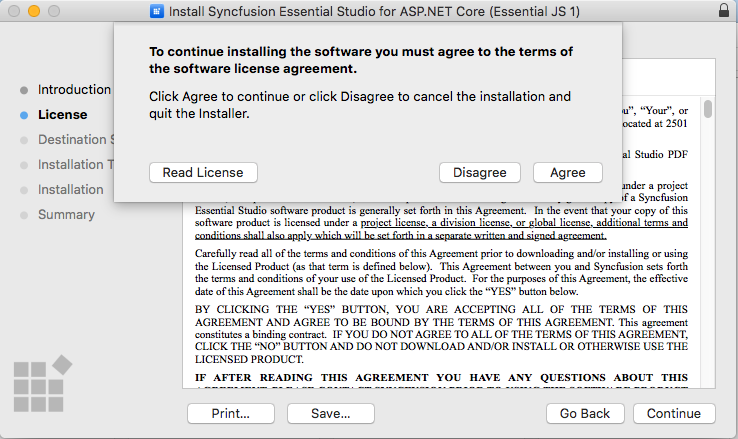
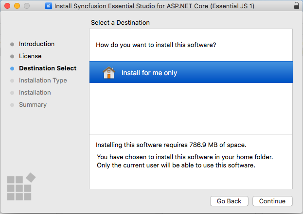
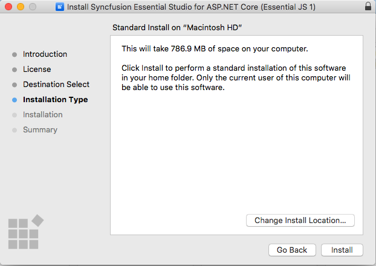
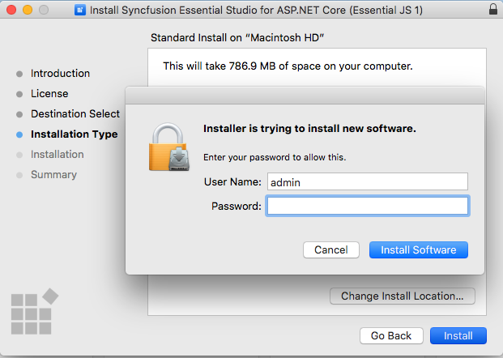
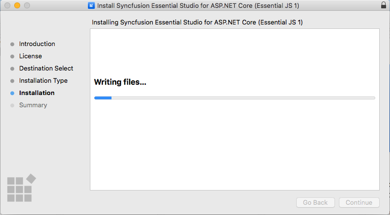
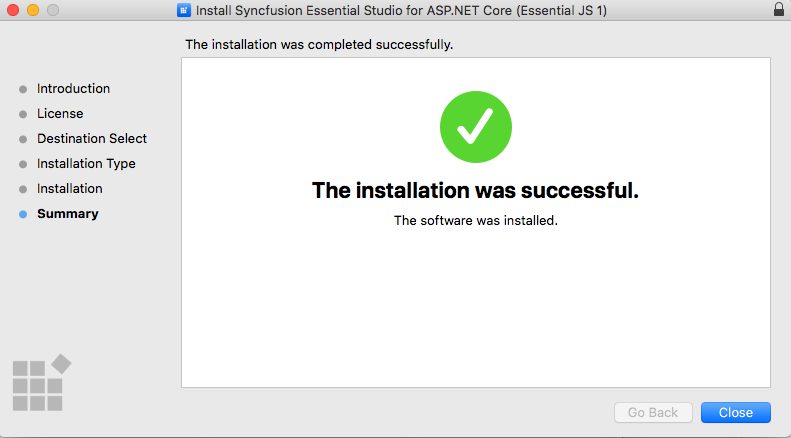
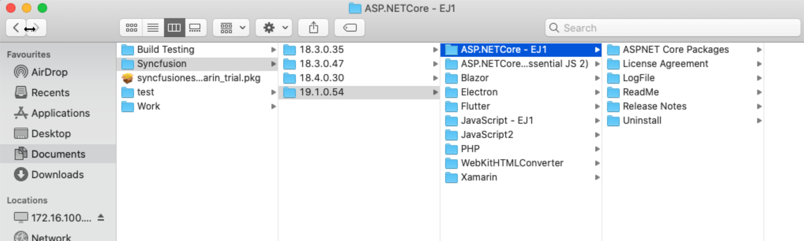

# ASP.NET Core Mac Installation

The steps below show how to install the Essential Studio ASP.NET Core Mac installer. 

1. Double-click the Syncfusion ASP.NET Core Mac installer(.pkg) file. The installer Wizard opens. Click Continue.

   
   

2. The Software License Agreement wizard will appear. Click the Continue button.

      
   

3. The License Agreement's Confirmation window will appear. If you have read the Software License Agreement, click **Agree**.

   
   
   N> The Unlock key is not required to install the Mac installer. The Syncfusion Mac installer can be used for development purposes without registering the Unlock key.

4. The Destination select wizard will appear. You can choose which disc to install the Syncfusion Essential Studio for ASP.NET Core Mac installer on here.

   

5. The Installation Type wizard will appear. Click Install to begin the standard installation of the Syncfusion ASP.NET Core Mac installer.

   

6. The Authentication window will appear. To begin the installation, enter the Mac machine's password and click **Install Software**.

   

7. The installation process will begin on your machine. 
   
   
   
8. Once the installation is complete, the completed screen will be displayed. To exit the installation wizard, click Close. 

   
   
   By default, Mac installer will install the files in following location.

   **Location:** {Documents}\Syncfusion\ {version}\ {platform}
   
   

