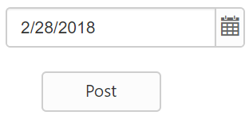
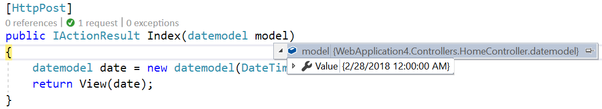
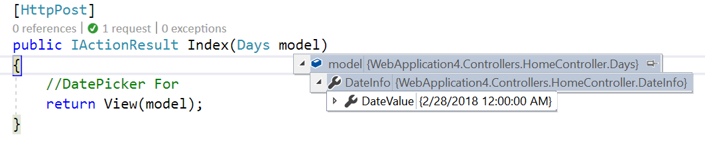

# Strongly-Typed Tag Helper

The Syncfusion editor controls supports the strongly typed Tag helpers represented by model expressions as attribute value for **ej-for** that have the model or template passed into the view. The Extension method is used to get a value from the model.

The Strongly-Typed Tag helper (i.e., DatePicker) takes model expressions as a parameter that tells the helper, which element of the model to be used in the typed view.

The Strongly typed views are used for rendering specific types of model objects, instead of using the general ViewData structure.

The following list of controls supports the Strongly-Typed HTML Helper:

* Autocomplete
* Checkbox and Radio Button
* DatePicker
* DateTimePicker
* DropDownList
* Mask Edit
* Numeric, Currency, and Percentage Textbox
* RichTextEditor
* TimePicker

The following steps explain how to use the strongly typed helpers to create a DatePicker.

The DatePicker control supports strongly typed Tag helpers that uses model expression as value for **ej-for** to refer to the models or view models passed to a view template. These helpers allows you to define the value of the DatePickerFor from the model.

Add a class name “CurrentDate” in the DatePickerController and replace the code with the following code:



        public class CurrentDate
        {
            public DateTime Value
            {
                get; set;
            }
            public CurrentDate(DateTime value) {
                Value = value;
            }
            public CurrentDate() { }
        }
    


Create an action method that renders the DatePicker on the view page, and passes the model to be bound to the view page.



    public IActionResult DatePickerFor()
    {
        //DatePicker For
        CurrentDate date = new CurrentDate();
        date.Value = DateTime.Now;
        return View(date);
    }
    


In View, invoke the strongly typed DatePickerFor tag helper with the  **ModelExpression** as attribute value for **ej-for** to set the default value.



        @model WebApplication.Controllers.DatePickerController.CurrentDate

        <form method="post">
            

                

                    <ej-date-picker id="datepick" ej-for="@Model.Value"/>
                    <ej-button id="button" text="Post" type="Submit" />
                

            

        </form>



The following steps explain how to get the values by using the Scaffolding methods in Post back.

1. Create an action method, FormPost that handles the Post request and processes the data.
In the action method, you can pass the model as the parameter and that model has the DatePicker’s value.



     [HttpPost]
        public IActionResult DatePickerFor(CurrentDate model)
        {
            CurrentDate date = new CurrentDate(DateTime.Now);
            return View(date);
        }



On clicking the button, the Post method will be triggered. In that, the selected value will be obtained as follows.

## Client Side Validation

With the client-side validation, the input data is checked as soon as they are submitted, so there is no postback to the server and no page refresh.

By default, client-side validation is enabled. But it can be easily enabled or disabled by using the **ValidationRules** and **ValidationMessages** properties of EJ input controls.



    <form method="post"> 
        

            

                <ej-date-picker id="datepick" ej-for="@Model.Value"
                                validation-rules='new Dictionary<string, object>() { { "required",true} }'
                                validation-messages='new Dictionary<string, object>() { { "required","Date value is required"} }' />
                
                <ej-button id="button" text="Post" type="Submit" />
            

        

    </form>



Refer to the jQuery validation script file in the _Layout page as shown in the following code example.



    
    



The jQuery validation plug-in takes the advantage of the Data Annotation attributes defined in the model.

Step 1: Add the following namespace to the “CurrentDate” model.



    using System.ComponentModel.DataAnnotations;
    


The Data Annotations allows to decorate model classes with the metadata. This metadata describes a set of rules that are used to validate a property.

The following Data Annotation attributes are used for the DatePicker.
Required: Indicates that the property is a required field.

Step 2: Next, Update the Value property of the “CurrentDate” class as “Required Field” by adding the following line.



    using System.ComponentModel.DataAnnotations;
    public class CurrentDate
    {
        [Required(ErrorMessage = "Date Value is Required")]
        public DateTime Value
        {
            get; set;
        }
        public CurrentDate(DateTime value)
        {
            Value = value;
        }
        public CurrentDate() { }
    }



## Server Side Validation

In the server-side validation, the page must be submitted via a postback to validate on the server and if the model data is not valid, the server sends a response back to the client.

The best way to validate a model is by using the Data Annotations that has a set of attributes and classes defined in the System.ComponentModel.DataAnnotations assembly.

Step 1: Add the following namespace to the “CurrentDate” model.



    using System.ComponentModel.DataAnnotations;
    


The Data Annotations allows to decorate model classes with the metadata. This metadata describes a set of rules that are used to validate a property.

The following Data Annotation attributes are used for the DatePicker.
Required: Indicates that the property is a required field.

Step 2: Next, Update the Value property of the “CurrentDate” class as “Required Field” by adding the following line



    using System.ComponentModel.DataAnnotations;
    public class CurrentDate
    {
        [Required(ErrorMessage = "Valid Date is Required")]
        public object dateValue { get; set; }

    }



Step 3: Modify the view page as follows:



    @model WebApplication4.Controllers.DatePickerController.CurrentDate
    <form method="post">
        <ej-date-picker id="datepick" ej-for="@Model.dateValue"></ej-date-picker>
        @*for control rendering with model binding.*@
         
        <button id="sub" type="submit">Submit</button>
    </form>
    


When you press the “Submit” button on this page then it will post the data to the server and the code written with in CurrentDate action will validate the DatePicker value by checking the ModelState.IsValid property. If the DatePicker value is not selected, the ModelState.IsValid will return false and display error message.

## Complex Model Binding

The **ej-for** Model Expressions are quite powerful, allows you to build quite complex edit models and have model binding that put everything back together again. A complex view model type such as:



        public class Days
        {
            public DateInfo DateInfo { get; set; }
            public Days(DateInfo info)
            {
                DateInfo = info;
            }
            public Days() { }
        }

        public class DateInfo
        {
            public DateTime DateValue { get; set; }
            public DateInfo(DateTime date)
            {
                DateValue = date;
            }
            public DateInfo() { }
        }
    


Create an action method that renders DatePicker on the view page, and passes the model to be bound to the view page.



        public IActionResult DatePickerFor()
        {
            return View(new Days(new DateInfo(DateTime.Now)));
        }



In View, invoke the strongly typed DatePickerFor helper with the lambda expression to set the default value.



    @model WebApplication4.Controllers.DatePickerController.Days
    <form method="post">
        

            

                <ej-date-picker id="datepick" ej-for="@Model.DateInfo.DateValue"
                                validation-rules='new Dictionary<string, object>() { { "required",true} }'
                                validation-messages='new Dictionary<string, object>() { { "required","Date value is required"} }' />
                
                <ej-button id="button" text="Post" type="Submit" width="100px" />
            

        

    </form>
    



When the form is submitted, it will perform an HTTP Post request to the controller. The action with the HttpPost attribute will handle the request.



     [HttpPost]
        public IActionResult DatePickerFor(Days model)
        {
            //DatePicker For
            return View(model);
        }



In the above code, the selected value of DatePicker will be obtained as follows:

